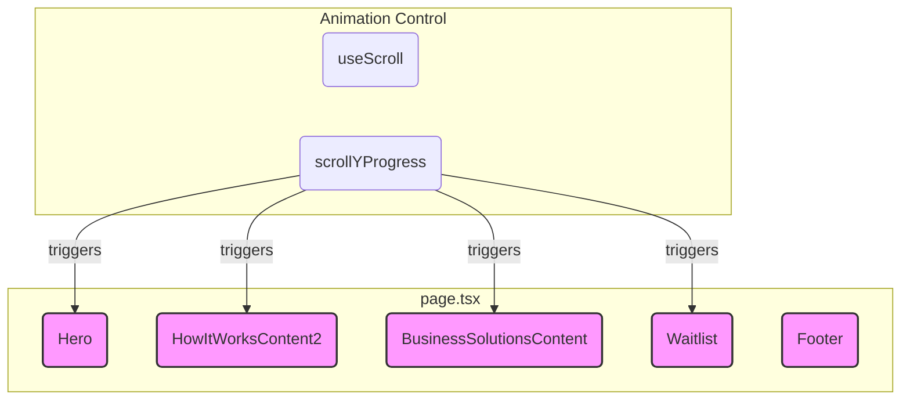
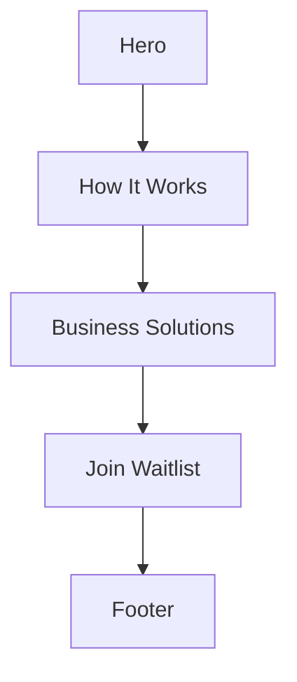

**User:**

<task>
'koti-landing-page/src/' (see below for folder content) 'koti-landing-page/src/components/Hero.tsx' (see below for file content) 'koti-landing-page/src/components/Header.tsx' (see below for file content) 'koti-landing-page/src/components/Footer.tsx' (see below for file content) 'koti-landing-page/src/components/BusinessSolutionsContent.tsx' (see below for file content) 'koti-landing-page/src/components/HowItWorksContent2.tsx' (see below for file content) 
nOW BEFORE fOOTER NAD AFTER BUSSINESS SOLTION PUT ANOTHER PAGE CALLINNG wAITLIST THAT WOULD HAVE THE SAME CARD LIKE STRUCTURE AS hERO AND hOW IT WORKS 2 PAGE . lOOK AT PICTURE WHICH IS YEELDS JOIN WAITLIST PAGE. i ALSO WANT SIMILET PHONE IMAGE IN DESIGN.  IN AI SALES inside 'reference/pixaai/index.html' (see below for file content)  therei is a mock up repository where the would get some code  some code to get css class that can design up mobile and inside mobile put couple of existing credit scoring and bussiness solusion conpcepts Koti: Everything you need, nothing you don't. this not out moto change it up looking at other ontien Your credit Your Poewr:... that one is out moto also the scrolling effects from Bussiness solutions card to Join wait list page is completely messed up after all the egiht card stack up in page 3 of Bussiness solution the Waitlist page should start to come uop. Now I can not see any of the cards in bussiness solution rather when scolling down join wailistt page start to come up okay so couple of key things you have to understand okay couple of key things that you have to understand the first key thing is that the first key thing is that like page one scrolls down page two stuck stuck on top of it then paste to get sticky paste three stack on top of it then all the eight card as you scroll down stack on top of it they move the potty waiting paste needs to come into the picture okay so that's the transition that you have to think about. Okay. Okay. In the page, we have some code. They try to simulate all these four pages in the page script. Also, in the business solution content script, you would see how that page handles other timing for their other cards stacking up. So look at all the codes. First make a comprehensive plan then try to solve this. C:\Users\fadul\KotiLandingPage\reference\WaitlistContent.tsx
So, in the waitlist content script, you would see a script that I have created for the waitlist page. But the main problem that I am facing is that as I am adding up the joint waitlist page at the end of business solution page, my website is breaking up. So when I first land into the business solution page, the idea is from page 2, how it works, it sticks and page 3 comes up, page 3 takes the whole screen, then as I scroll down, each of the cards stacks up. until I start to get to the footer. Okay, so that is the current idea of the whole website. But whenever after business solution I try to add this join list my scrolling transition gets messed up most of the time business solution cards goes missing or something else so what I want you to do is like for join do at least you can almost use the code that I have given you that you have in the reference folder but what you to do is like you need to deeply investigate how the scrolling mechanism is working across the website okay you have playwright too or you have puppeteer to maneuver the website and see why it is not working so your job is to meticulously plan ahead on how uh like how we can uh apply how how we can incorporate this joint with this space without breaking up the website's current uh scrolling animation and effects
</task>

<folder_content path="koti-landing-page/src/">
├── app/
├── components/
└── lib/
</folder_content>

<file_content path="koti-landing-page/src/components/Hero.tsx">
  1 | "use client";
  2 | import { useState, useEffect } from "react";
  3 | import { motion } from "framer-motion";
  4 | import Image from "next/image";
  5 | 
  6 | type Language = "bn" | "en";
  7 | 
  8 | interface HeroProps {
  9 |   lang: Language;
 10 | }
 11 | 
 12 | const Hero = ({ lang }: HeroProps) => {
 13 |   const [animatedScore, setAnimatedScore] = useState(0);
 14 | 
 15 |   useEffect(() => {
 16 |     const timer = setTimeout(() => {
 17 |       let currentScore = 0;
 18 |       const interval = setInterval(() => {
 19 |         currentScore += 5;
 20 |         setAnimatedScore(currentScore);
 21 | 
 22 |         if (currentScore >= 765) {
 23 |           clearInterval(interval);
 24 |           setAnimatedScore(765);
 25 |         }
 26 |       }, 20);
 27 |       return () => clearInterval(interval);
 28 |     }, 500);
 29 | 
 30 |     return () => clearTimeout(timer);
 31 |   }, []);
 32 | 
 33 |   // MATHEMATICAL CALCULATION - Real-time bar position based on current score
 34 |   const calculateBarPosition = (score: number): number => {
 35 |     return Math.max(0, Math.min(100, ((score - 300) / (850 - 300)) * 100));
 36 |   };
 37 | 
 38 |   // Function to convert numbers to Bengali numerals
 39 |   const toBengaliNumerals = (num: number): string => {
 40 |     const bengaliDigits = ["০", "১", "২", "৩", "৪", "৫", "৬", "৭", "৮", "৯"];
 41 |     return num
 42 |       .toString()
 43 |       .split("")
 44 |       .map((digit) => bengaliDigits[parseInt(digit)])
 45 |       .join("");
 46 |   };
 47 | 
 48 |   // Helper function to get risk category
 49 |   const getRiskCategory = (score: number) => {
 50 |     if (score >= 750)
 51 |       return { category: "Excellent", color: "bg-green-500", range: "750+" };
 52 |     if (score >= 700)
 53 |       return { category: "Very Good", color: "bg-lime-400", range: "700-749" };
 54 |     if (score >= 650)
 55 |       return { category: "Good", color: "bg-yellow-400", range: "650-699" };
 56 |     if (score >= 600)
 57 |       return { category: "Fair", color: "bg-orange-400", range: "600-649" };
 58 |     return { category: "Poor", color: "bg-red-500", range: "300-599" };
 59 |   };
 60 | 
 61 |   const content = {
 62 |     bn: {
 63 |       title: "আপনার কোটি স্কোর কত?",
 64 |       fullSlogan:
 65 |         "আপনার ক্রেডিট, আপনার শক্তি: প্রতিদিনের ছোট পছন্দে গড়ুন বড় অর্থনৈতিক প্রভাব",
 66 |       button: "কোটি স্কোর চেক করুন",
 67 |       scoreLabel: "কোটি স্কোর",
 68 |       scoreRange: "পরিসীমা: ৩০০-৮৫০",
 69 |       categories: {
 70 |         Excellent: "চমৎকার",
 71 |         "Very Good": "খুব ভাল",
 72 |         Good: "ভাল",
 73 |         Fair: "মোটামুটি",
 74 |         Poor: "দুর্বল",
 75 |       },
 76 |     },
 77 |     en: {
 78 |       title: "What's Your Koti Score?",
 79 |       fullSlogan:
 80 |         "Your Credit, Your Power: Turn everyday small choices into big economic impact",
 81 |       button: "Check Koti Score",
 82 |       scoreLabel: "Koti Score",
 83 |       scoreRange: "Range: 300-850",
 84 |       categories: {
 85 |         Excellent: "Excellent",
 86 |         "Very Good": "Very Good",
 87 |         Good: "Good",
 88 |         Fair: "Fair",
 89 |         Poor: "Poor",
 90 |       },
 91 |     },
 92 |   };
 93 | 
 94 |   const currentContent = content[lang];
 95 |   const riskInfo = getRiskCategory(animatedScore);
 96 |   const currentBarPosition = calculateBarPosition(animatedScore);
 97 | 
 98 |   return (
 99 |     <section
100 |       className="relative min-h-screen w-full flex items-center justify-center px-3 py-3 bg-[#fdfdfd]"
101 |       data-oid="mjnlw11"
102 |     >
103 |       {/* Balanced scaling - fills most of viewport with nice white space border */}
104 |       <div
105 |         className="relative w-[96vw] h-[94vh] rounded-lg sm:rounded-xl md:rounded-2xl lg:rounded-3xl overflow-hidden shadow-2xl"
106 |         data-oid="5omrsib"
107 |       >
108 |         {/* Image as background for the container only */}
109 |         <div className="absolute inset-0" data-oid="mvwt4rl">
110 |           <Image
111 |             src="/hero-image.png"
112 |             alt="Koti Credit Services"
113 |             fill
114 |             className="object-cover"
115 |             priority
116 |             data-oid="0ku1s6l"
117 |           />
118 | 
119 |           {/* Overlay for better text readability */}
120 |           <div
121 |             className="absolute inset-0 bg-gradient-to-r from-black/60 via-black/40 to-black/30"
122 |             data-oid="4zxrgom"
123 |           />
124 |         </div>
125 | 
126 |         {/* Content positioned over the contained background like Yeeld */}
127 |         <div
128 |           className="relative z-10 h-full flex items-center"
129 |           data-oid="8sqqqrc"
130 |         >
131 |           <div
132 |             className="w-full max-w-7xl mx-auto px-4 sm:px-6 lg:px-12 py-6 sm:py-8 lg:py-16"
133 |             data-oid=".l71wk6"
134 |           >
135 |             {/* STANDARDIZED GRID - Fixed gap between left content and right card */}
136 |             <div
137 |               className="grid grid-cols-1 lg:grid-cols-2 gap-8 lg:gap-16 xl:gap-20 items-center h-full"
138 |               data-oid="1lykgmm"
139 |             >
140 |               {/* Left column - Text content - FIXED WIDTH */}
141 |               <motion.div
142 |                 initial={{ opacity: 0, x: -50 }}
143 |                 animate={{ opacity: 1, x: 0 }}
144 |                 transition={{ duration: 0.8 }}
145 |                 className="space-y-4 sm:space-y-6 lg:space-y-8"
146 |                 data-oid="besoru8"
147 |               >
148 |                 <div
149 |                   className="space-y-3 sm:space-y-4 lg:space-y-6"
150 |                   data-oid="tzu_yjt"
151 |                 >
152 |                   <h1
153 |                     className="text-3xl sm:text-4xl md:text-5xl lg:text-6xl xl:text-7xl font-bold leading-tight tracking-tight text-white"
154 |                     data-oid="wsr.n0b"
155 |                   >
156 |                     <span className="block" data-oid="d0bfgb1">
157 |                       {currentContent.title}
158 |                     </span>
159 |                   </h1>
160 | 
161 |                   {/* Complete slogan */}
162 |                   <h2
163 |                     className="text-sm sm:text-base md:text-lg lg:text-xl xl:text-2xl font-medium text-white/90 leading-relaxed max-w-2xl"
164 |                     data-oid="dmf35sb"
165 |                   >
166 |                     {currentContent.fullSlogan}
167 |                   </h2>
168 |                 </div>
169 | 
170 |                 {/* AISales-style button */}
171 |                 <motion.button
172 |                   whileHover={{ scale: 1.05 }}
173 |                   whileTap={{ scale: 0.95 }}
174 |                   className="inline-flex items-center gap-2 sm:gap-3 rounded-full bg-[#6dbb00] px-4 sm:px-6 lg:px-8 py-2.5 sm:py-3 lg:py-4 text-sm sm:text-base lg:text-lg font-semibold text-[#0d0d0d] shadow-lg transition-all duration-300 hover:bg-[#5da600] hover:shadow-xl"
175 |                   data-oid="cm4zc1m"
176 |                 >
177 |                   <span data-oid="ehdcmze">{currentContent.button}</span>
178 |                   <span data-oid="q96m2o8">→</span>
179 |                 </motion.button>
180 |               </motion.div>
181 | 
182 |               {/* Right column - Koti Score visualization - BIGGER CONTAINER */}
183 |               <motion.div
184 |                 initial={{ opacity: 0, x: 50 }}
185 |                 animate={{ opacity: 1, x: 0 }}
186 |                 transition={{ duration: 0.8, delay: 0.2 }}
187 |                 className="flex justify-center lg:justify-end"
188 |                 data-oid="4e7x14i"
189 |               >
190 |                 {/* BIGGER Koti Score Card - Increased size */}
191 |                 <div
192 |                   className="w-full max-w-lg rounded-xl sm:rounded-2xl lg:rounded-3xl bg-white/10 backdrop-blur-md border border-white/20 p-6 sm:p-8 lg:p-12 shadow-2xl"
193 |                   data-oid="9uezztv"
194 |                 >
195 |                   {/* Score display - ALL ANIMATIONS START AT SAME TIME (delay: 0.8) */}
196 |                   <div className="text-center mb-8 lg:mb-10" data-oid="31y0:_.">
197 |                     <motion.div
198 |                       initial={{ scale: 0 }}
199 |                       animate={{ scale: 1 }}
200 |                       transition={{ duration: 0.6, delay: 0.8 }}
201 |                       className="text-5xl sm:text-6xl lg:text-7xl xl:text-8xl font-bold text-[#6dbb00] mb-4"
202 |                       data-oid="ok5_dg5"
203 |                     >
204 |                       {lang === "bn"
205 |                         ? toBengaliNumerals(animatedScore)
206 |                         : animatedScore}
207 |                     </motion.div>
208 |                     <div
209 |                       className="text-lg sm:text-xl lg:text-2xl font-medium text-white/90 mb-3"
210 |                       data-oid="602b75h"
211 |                     >
212 |                       {currentContent.scoreLabel}
213 |                     </div>
214 |                     <div
215 |                       className="text-sm sm:text-base text-white/70"
216 |                       data-oid=":bligmm"
217 |                     >
218 |                       {currentContent.scoreRange}
219 |                     </div>
220 |                   </div>
221 | 
222 |                   {/* Score Range Bar - WIDER BAR */}
223 |                   <motion.div
224 |                     initial={{ opacity: 0 }}
225 |                     animate={{ opacity: 1 }}
226 |                     transition={{ duration: 0.8, delay: 0.8 }}
227 |                     className="mb-8"
228 |                     data-oid="2l7nv15"
229 |                   >
230 |                     {/* Score range visualization - MUCH BIGGER BAR */}
231 |                     <div
232 |                       className="relative h-14 lg:h-16 bg-white/20 rounded-xl overflow-hidden mb-8"
233 |                       data-oid="03p7xce"
234 |                     >
235 |                       {/* Smooth gradient background - Red to Green transition */}
236 |                       <div
237 |                         className="absolute inset-0 bg-gradient-to-r from-red-500 via-orange-400 via-yellow-400 via-lime-400 to-green-500 rounded-xl"
238 |                         data-oid="r7bke0n"
239 |                       ></div>
240 | 
241 |                       {/* Optional: Add subtle shadow overlay for depth */}
242 |                       <div
243 |                         className="absolute inset-0 bg-gradient-to-b from-transparent via-transparent to-black/10 rounded-xl"
244 |                         data-oid="b.im3pq"
245 |                       ></div>
246 | 
247 |                       {/* MATHEMATICALLY SYNCHRONIZED pointer - moves with score in real-time */}
248 |                       <motion.div
249 |                         className="absolute top-0 h-full transform -translate-x-1/2"
250 |                         style={{ left: `${currentBarPosition}%` }}
251 |                         initial={{ opacity: 0 }}
252 |                         animate={{ opacity: 1 }}
253 |                         transition={{ duration: 0.3, delay: 0.8 }}
254 |                         data-oid="2igii._"
255 |                       >
256 |                         {/* Pointer line */}
257 |                         <div
258 |                           className="w-1.5 h-full bg-white shadow-lg"
259 |                           data-oid="z4-9w82"
260 |                         ></div>
261 |                         {/* Triangle pointer at top */}
262 |                         <div
263 |                           className="absolute -top-3 left-1/2 transform -translate-x-1/2"
264 |                           data-oid="arydi.w"
265 |                         >
266 |                           <div
267 |                             className="w-0 h-0 border-l-[8px] border-r-[8px] border-b-[10px] border-l-transparent border-r-transparent border-b-white"
268 |                             data-oid="hy5hik4"
269 |                           ></div>
270 |                         </div>
271 |                         {/* Triangle pointer at bottom */}
272 |                         <div
273 |                           className="absolute -bottom-3 left-1/2 transform -translate-x-1/2"
274 |                           data-oid="xs5:fk0"
275 |                         >
276 |                           <div
277 |                             className="w-0 h-0 border-l-[8px] border-r-[8px] border-t-[10px] border-l-transparent border-r-transparent border-t-white"
278 |                             data-oid="ty8q.2y"
279 |                           ></div>
280 |                         </div>
281 |                         {/* Glowing effect */}
282 |                         <div
283 |                           className="absolute inset-0 w-1.5 h-full bg-white opacity-50 blur-sm"
284 |                           data-oid="0bsblmt"
285 |                         ></div>
286 |                       </motion.div>
287 |                     </div>
288 | 
289 |                     {/* Score range labels with actual ranges - BIGGER TEXT */}
290 |                     <div
291 |                       className="grid grid-cols-5 gap-0 text-sm text-white/80 mb-6"
292 |                       data-oid="pyc3l00"
293 |                     >
294 |                       <div className="text-center" data-oid="tz0vaxw">
295 |                         <div
296 |                           className="text-red-300 font-semibold mb-1"
297 |                           data-oid="kgn7-c9"
298 |                         >
299 |                           {currentContent.categories["Poor"]}
300 |                         </div>
301 |                         <div className="text-xs opacity-70" data-oid="d3v_9:4">
302 |                           (
303 |                           {lang === "bn"
304 |                             ? `${toBengaliNumerals(300)}-${toBengaliNumerals(599)}`
305 |                             : "300-599"}
306 |                           )
307 |                         </div>
308 |                       </div>
309 |                       <div className="text-center" data-oid="r7ddw_r">
310 |                         <div
311 |                           className="text-orange-300 font-semibold mb-1"
312 |                           data-oid="njqz-9w"
313 |                         >
314 |                           {currentContent.categories["Fair"]}
315 |                         </div>
316 |                         <div className="text-xs opacity-70" data-oid="0jytziq">
317 |                           (
318 |                           {lang === "bn"
319 |                             ? `${toBengaliNumerals(600)}-${toBengaliNumerals(649)}`
320 |                             : "600-649"}
321 |                           )
322 |                         </div>
323 |                       </div>
324 |                       <div className="text-center" data-oid="gvk7dtk">
325 |                         <div
326 |                           className="text-yellow-300 font-semibold mb-1"
327 |                           data-oid="y7q0ymy"
328 |                         >
329 |                           {currentContent.categories["Good"]}
330 |                         </div>
331 |                         <div className="text-xs opacity-70" data-oid="q721sna">
332 |                           (
333 |                           {lang === "bn"
334 |                             ? `${toBengaliNumerals(650)}-${toBengaliNumerals(699)}`
335 |                             : "650-699"}
336 |                           )
337 |                         </div>
338 |                       </div>
339 |                       <div className="text-center" data-oid="1w57jd8">
340 |                         <div
341 |                           className="text-lime-300 font-semibold mb-1"
342 |                           data-oid="i3ae0eu"
343 |                         >
344 |                           {currentContent.categories["Very Good"]}
345 |                         </div>
346 |                         <div className="text-xs opacity-70" data-oid="4vpz5t3">
347 |                           (
348 |                           {lang === "bn"
349 |                             ? `${toBengaliNumerals(700)}-${toBengaliNumerals(749)}`
350 |                             : "700-749"}
351 |                           )
352 |                         </div>
353 |                       </div>
354 |                       <div className="text-center" data-oid="h1zrx4v">
355 |                         <div
356 |                           className="text-green-300 font-semibold mb-1"
357 |                           data-oid="59n-rx7"
358 |                         >
359 |                           {currentContent.categories["Excellent"]}
360 |                         </div>
361 |                         <div className="text-xs opacity-70" data-oid="o5f4oq:">
362 |                           (
363 |                           {lang === "bn"
364 |                             ? `${toBengaliNumerals(750)}+`
365 |                             : "750+"}
366 |                           )
367 |                         </div>
368 |                       </div>
369 |                     </div>
370 | 
371 |                     {/* Current category badge - REAL-TIME UPDATES based on current score */}
372 |                     <motion.div
373 |                       initial={{ opacity: 0, scale: 0.8 }}
374 |                       animate={{ opacity: 1, scale: 1 }}
375 |                       transition={{ duration: 0.5, delay: 0.8 }}
376 |                       className="text-center mt-6"
377 |                       data-oid="n8em0wk"
378 |                     >
379 |                       <div
380 |                         className={`inline-block px-6 py-3 rounded-full text-white font-semibold text-base ${riskInfo.color}`}
381 |                         data-oid="hw4_ghf"
382 |                       >
383 |                         {
384 |                           currentContent.categories[
385 |                             riskInfo.category as keyof typeof currentContent.categories
386 |                           ]
387 |                         }
388 |                       </div>
389 |                       <div
390 |                         className="text-sm text-white/70 mt-2"
391 |                         data-oid="gd.f65:"
392 |                       >
393 |                         {lang === "bn"
394 |                           ? toBengaliNumerals(
395 |                               parseInt(riskInfo.range.split("-")[0]),
396 |                             )
397 |                           : riskInfo.range.split("-")[0]}
398 |                         {riskInfo.range.includes("-") && (
399 |                           <>
400 |                             -
401 |                             {lang === "bn"
402 |                               ? toBengaliNumerals(
403 |                                   parseInt(riskInfo.range.split("-")[1]),
404 |                                 )
405 |                               : riskInfo.range.split("-")[1]}
406 |                           </>
407 |                         )}
408 |                         {riskInfo.range.includes("+") && "+"}
409 |                       </div>
410 |                     </motion.div>
411 |                   </motion.div>
412 |                 </div>
413 |               </motion.div>
414 |             </div>
415 |           </div>
416 |         </div>
417 |       </div>
418 |     </section>
419 |   );
420 | };
421 | 
422 | export default Hero;

</file_content>

<file_content path="koti-landing-page/src/components/Header.tsx">
  1 | "use client";
  2 | import React, { useState, useEffect } from "react";
  3 | import Link from "next/link";
  4 | 
  5 | type Language = "bn" | "en";
  6 | 
  7 | interface HeaderProps {
  8 |   lang: Language;
  9 |   setLang: (lang: Language) => void;
 10 | }
 11 | 
 12 | const Header = ({ lang, setLang }: HeaderProps) => {
 13 |   const [isMenuOpen, setIsMenuOpen] = useState(false);
 14 |   const [isHeaderVisible, setIsHeaderVisible] = useState(true);
 15 |   const [lastScrollY, setLastScrollY] = useState(0);
 16 | 
 17 |   useEffect(() => {
 18 |     const handleScroll = () => {
 19 |       const currentScrollY = window.scrollY;
 20 |       
 21 |       // Show header when at top of page
 22 |       if (currentScrollY <= 10) {
 23 |         setIsHeaderVisible(true);
 24 |       }
 25 |       // Hide header when scrolling down, show when scrolling up
 26 |       else if (currentScrollY > lastScrollY && currentScrollY > 100) {
 27 |         // Scrolling down & past threshold
 28 |         setIsHeaderVisible(false);
 29 |       } else if (currentScrollY < lastScrollY) {
 30 |         // Scrolling up
 31 |         setIsHeaderVisible(true);
 32 |       }
 33 |       
 34 |       setLastScrollY(currentScrollY);
 35 |     };
 36 | 
 37 |     // Throttle scroll events for better performance
 38 |     let ticking = false;
 39 |     const throttledHandleScroll = () => {
 40 |       if (!ticking) {
 41 |         requestAnimationFrame(() => {
 42 |           handleScroll();
 43 |           ticking = false;
 44 |         });
 45 |         ticking = true;
 46 |       }
 47 |     };
 48 | 
 49 |     window.addEventListener('scroll', throttledHandleScroll, { passive: true });
 50 |     
 51 |     return () => {
 52 |       window.removeEventListener('scroll', throttledHandleScroll);
 53 |     };
 54 |   }, [lastScrollY]);
 55 | 
 56 |   const toggleMenu = () => {
 57 |     setIsMenuOpen(!isMenuOpen);
 58 |   };
 59 | 
 60 |   // Smooth scroll to specific sections
 61 |   const scrollToSection = (sectionNumber: number) => {
 62 |     const viewportHeight = window.innerHeight;
 63 |     let targetScroll = 0;
 64 | 
 65 |     switch (sectionNumber) {
 66 |       case 1: // Hero section
 67 |         targetScroll = 0;
 68 |         break;
 69 |       case 2: // HowItWorksContent2 section
 70 |         targetScroll = viewportHeight;
 71 |         break;
 72 |       case 3: // BusinessSolutionsContent section  
 73 |         targetScroll = viewportHeight * 2;
 74 |         break;
 75 |       default:
 76 |         targetScroll = 0;
 77 |     }
 78 | 
 79 |     window.scrollTo({
 80 |       top: targetScroll,
 81 |       behavior: 'smooth'
 82 |     });
 83 | 
 84 |     // Close mobile menu after navigation
 85 |     setIsMenuOpen(false);
 86 |   };
 87 | 
 88 |   return (
 89 |     <>
 90 |       {/* Yeeld-style floating pill header */}
 91 |       <header
 92 |         className={`fixed top-6 left-1/2 transform -translate-x-1/2 z-50 transition-all duration-300 ease-in-out ${
 93 |           isHeaderVisible ? 'translate-y-0 opacity-100' : '-translate-y-20 opacity-0'
 94 |         }`}
 95 |         data-oid="6e4qj7p"
 96 |       >
 97 |         {/* Pill-shaped container matching Yeeld design */}
 98 |         <div className="flex items-center justify-between bg-[#1a1a1a]/95 backdrop-blur-xl rounded-full px-6 py-3 shadow-2xl border border-white/10 min-w-[320px] max-w-6xl">
 99 |           {/* Logo - Click to go to Hero section */}
100 |           <button
101 |             onClick={() => scrollToSection(1)}
102 |             className="text-2xl font-bold text-white hover:text-[#6dbb00] transition-colors duration-300 flex-shrink-0 cursor-pointer"
103 |             data-oid="el86tr_"
104 |           >
105 |             Koti
106 |           </button>
107 | 
108 |           {/* Desktop Navigation - centered */}
109 |           <nav className="hidden lg:flex items-center gap-8 mx-8">
110 |             <button
111 |               onClick={() => scrollToSection(2)}
112 |               className="text-white/90 hover:text-[#6dbb00] transition-colors duration-300 font-medium text-sm cursor-pointer"
113 |               data-oid="1em8vv-"
114 |             >
115 |               {lang === "bn" ? "কোটি কিভাবে কাজ করে" : "How Koti Work"}
116 |             </button>
117 |             <button
118 |               onClick={() => scrollToSection(3)}
119 |               className="text-white/90 hover:text-[#6dbb00] transition-colors duration-300 font-medium text-sm cursor-pointer"
120 |               data-oid="bb-bnvj"
121 |             >
122 |               {lang === "bn" ? "ব্যবসায়িক সমাধান" : "Business Solution"}
123 |             </button>
124 |             <Link
125 |               className="text-white/90 hover:text-[#6dbb00] transition-colors duration-300 font-medium text-sm"
126 |               href="#support"
127 |               data-oid="sp3.msi"
128 |             >
129 |               {lang === "bn" ? "সহায়তা" : "Support"}
130 |             </Link>
131 |           </nav>
132 | 
133 |           {/* Right side actions */}
134 |           <div className="flex items-center gap-3 flex-shrink-0">
135 |             {/* App store badges - Yeeld style with icons */}
136 |             <div className="hidden md:flex items-center gap-2">
137 |               {/* Google Play Store */}
138 |               <div className="flex items-center gap-2 rounded-full bg-white/10 px-3 py-1.5 text-xs text-white/80 border border-white/20 cursor-not-allowed">
139 |                 <svg className="w-4 h-4" viewBox="0 0 24 24" fill="currentColor">
140 |                   <path d="M3,20.5V3.5C3,2.91 3.34,2.39 3.84,2.15L13.69,12L3.84,21.85C3.34,21.61 3,21.09 3,20.5M16.81,15.12L6.05,21.34L14.54,12.85L16.81,15.12M20.16,10.81C20.5,11.08 20.75,11.5 20.75,12C20.75,12.5 20.53,12.92 20.18,13.18L17.89,14.5L15.39,12L17.89,9.5L20.16,10.81M6.05,2.66L16.81,8.88L14.54,11.15L6.05,2.66Z"/>
141 |                 </svg>
142 |                 <span>{lang === "bn" ? "শীঘ্রই আসছে" : "Available Soon"}</span>
143 |               </div>
144 |               
145 |               {/* Apple App Store */}
146 |               <div className="flex items-center gap-2 rounded-full bg-white/10 px-3 py-1.5 text-xs text-white/80 border border-white/20 cursor-not-allowed">
147 |                 <svg className="w-4 h-4" viewBox="0 0 24 24" fill="currentColor">
148 |                   <path d="M18.71,19.5C17.88,20.74 17,21.95 15.66,21.97C14.32,22 13.89,21.18 12.37,21.18C10.84,21.18 10.37,21.95 9.1,22C7.79,22.05 6.8,20.68 5.96,19.47C4.25,17 2.94,12.45 4.7,9.39C5.57,7.87 7.13,6.91 8.82,6.88C10.1,6.86 11.32,7.75 12.11,7.75C12.89,7.75 14.37,6.68 15.92,6.84C16.57,6.87 18.39,7.1 19.56,8.82C19.47,8.88 17.39,10.19 17.41,12.63C17.44,15.65 20.06,16.66 20.09,16.67C20.06,16.74 19.67,18.11 18.71,19.5M13,3.5C13.73,2.67 14.94,2.04 15.94,2C16.07,3.17 15.6,4.35 14.9,5.19C14.21,6.04 13.07,6.7 11.95,6.61C11.8,5.46 12.36,4.26 13,3.5Z"/>
149 |                 </svg>
150 |                 <span>{lang === "bn" ? "শীঘ্রই আসছে" : "Available Soon"}</span>
151 |               </div>
152 |             </div>
153 | 
154 |             {/* Language switcher */}
155 |             <div className="flex items-center bg-white/10 rounded-full p-1">
156 |               <button
157 |                 onClick={() => setLang("bn")}
158 |                 className={`px-3 py-1.5 rounded-full text-xs font-medium transition-all duration-300 ${
159 |                   lang === "bn"
160 |                     ? "bg-[#6dbb00] text-black"
161 |                     : "text-white/80 hover:text-white"
162 |                 }`}
163 |               >
164 |                 বাং
165 |               </button>
166 |               <button
167 |                 onClick={() => setLang("en")}
168 |                 className={`px-3 py-1.5 rounded-full text-xs font-medium transition-all duration-300 ${
169 |                   lang === "en"
170 |                     ? "bg-[#6dbb00] text-black"
171 |                     : "text-white/80 hover:text-white"
172 |                 }`}
173 |               >
174 |                 EN
175 |               </button>
176 |             </div>
177 | 
178 |             {/* Mobile menu button */}
179 |             <button
180 |               className="lg:hidden ml-2 flex h-8 w-8 flex-col items-center justify-center gap-1"
181 |               onClick={toggleMenu}
182 |               data-oid="r1cv:12"
183 |             >
184 |               <span
185 |                 className={`h-0.5 w-5 bg-white transition-all duration-300 ${
186 |                   isMenuOpen ? "translate-y-1.5 rotate-45" : ""
187 |                 }`}
188 |               />
189 |               <span
190 |                 className={`h-0.5 w-5 bg-white transition-all duration-300 ${
191 |                   isMenuOpen ? "opacity-0" : ""
192 |                 }`}
193 |               />
194 |               <span
195 |                 className={`h-0.5 w-5 bg-white transition-all duration-300 ${
196 |                   isMenuOpen ? "-translate-y-1.5 -rotate-45" : ""
197 |                 }`}
198 |               />
199 |             </button>
200 |           </div>
201 |         </div>
202 |       </header>
203 | 
204 |       {/* Mobile menu overlay */}
205 |       {isMenuOpen && (
206 |         <div className="fixed inset-0 z-40 lg:hidden">
207 |           {/* Backdrop */}
208 |           <div 
209 |             className="absolute inset-0 bg-black/50 backdrop-blur-sm"
210 |             onClick={() => setIsMenuOpen(false)}
211 |           />
212 |           
213 |           {/* Mobile menu */}
214 |           <div className="absolute top-24 left-1/2 transform -translate-x-1/2 w-[90%] max-w-md">
215 |             <div className="bg-[#1a1a1a]/95 backdrop-blur-xl rounded-2xl p-6 shadow-2xl border border-white/10">
216 |               <nav className="flex flex-col gap-4">
217 |                 <button
218 |                   onClick={() => scrollToSection(2)}
219 |                   className="text-white/90 hover:text-[#6dbb00] transition-colors duration-300 font-medium py-2 text-left cursor-pointer"
220 |                 >
221 |                   {lang === "bn" ? "কোটি কিভাবে কাজ করে" : "How Koti Work"}
222 |                 </button>
223 |                 <button
224 |                   onClick={() => scrollToSection(3)}
225 |                   className="text-white/90 hover:text-[#6dbb00] transition-colors duration-300 font-medium py-2 text-left cursor-pointer"
226 |                 >
227 |                   {lang === "bn" ? "ব্যবসায়িক সমাধান" : "Business Solution"}
228 |                 </button>
229 |                 <Link
230 |                   className="text-white/90 hover:text-[#6dbb00] transition-colors duration-300 font-medium py-2"
231 |                   href="#support"
232 |                   onClick={() => setIsMenuOpen(false)}
233 |                 >
234 |                   {lang === "bn" ? "সহায়তা" : "Support"}
235 |                 </Link>
236 |                 
237 |                 {/* Mobile app badges with icons */}
238 |                 <div className="flex flex-col gap-2 pt-4 border-t border-white/20">
239 |                   <div className="flex items-center justify-center gap-2 rounded-full bg-white/10 px-4 py-2 text-xs text-white/80 border border-white/20 cursor-not-allowed">
240 |                     <svg className="w-4 h-4" viewBox="0 0 24 24" fill="currentColor">
241 |                       <path d="M3,20.5V3.5C3,2.91 3.34,2.39 3.84,2.15L13.69,12L3.84,21.85C3.34,21.61 3,21.09 3,20.5M16.81,15.12L6.05,21.34L14.54,12.85L16.81,15.12M20.16,10.81C20.5,11.08 20.75,11.5 20.75,12C20.75,12.5 20.53,12.92 20.18,13.18L17.89,14.5L15.39,12L17.89,9.5L20.16,10.81M6.05,2.66L16.81,8.88L14.54,11.15L6.05,2.66Z"/>
242 |                     </svg>
243 |                     <span>{lang === "bn" ? "শীঘ্রই • Google Play" : "Available Soon • Google Play"}</span>
244 |                   </div>
245 |                   <div className="flex items-center justify-center gap-2 rounded-full bg-white/10 px-4 py-2 text-xs text-white/80 border border-white/20 cursor-not-allowed">
246 |                     <svg className="w-4 h-4" viewBox="0 0 24 24" fill="currentColor">
247 |                       <path d="M18.71,19.5C17.88,20.74 17,21.95 15.66,21.97C14.32,22 13.89,21.18 12.37,21.18C10.84,21.18 10.37,21.95 9.1,22C7.79,22.05 6.8,20.68 5.96,19.47C4.25,17 2.94,12.45 4.7,9.39C5.57,7.87 7.13,6.91 8.82,6.88C10.1,6.86 11.32,7.75 12.11,7.75C12.89,7.75 14.37,6.68 15.92,6.84C16.57,6.87 18.39,7.1 19.56,8.82C19.47,8.88 17.39,10.19 17.41,12.63C17.44,15.65 20.06,16.66 20.09,16.67C20.06,16.74 19.67,18.11 18.71,19.5M13,3.5C13.73,2.67 14.94,2.04 15.94,2C16.07,3.17 15.6,4.35 14.9,5.19C14.21,6.04 13.07,6.7 11.95,6.61C11.8,5.46 12.36,4.26 13,3.5Z"/>
248 |                     </svg>
249 |                     <span>{lang === "bn" ? "শীঘ্রই • App Store" : "Available Soon • App Store"}</span>
250 |                   </div>
251 |                 </div>
252 |               </nav>
253 |             </div>
254 |           </div>
255 |         </div>
256 |       )}
257 |     </>
258 |   );
259 | };
260 | 
261 | export default Header;

</file_content>

<file_content path="koti-landing-page/src/components/Footer.tsx">
  1 | "use client";
  2 | import React from "react";
  3 | import Link from "next/link";
  4 | 
  5 | interface FooterProps {
  6 |   lang?: "bn" | "en";
  7 | }
  8 | 
  9 | const Footer = ({ lang = "bn" }: FooterProps) => {
 10 |   return (
 11 |     <footer className="bg-gray-900 text-white pt-16 pb-8" data-oid="xl8sjls">
 12 |       <div className="max-w-7xl mx-auto px-8" data-oid="footer-container">
 13 |         {/* Main Footer Content */}
 14 |         <div className="grid grid-cols-1 md:grid-cols-4 gap-12 mb-12" data-oid="footer-grid">
 15 |           
 16 |           {/* Company Info Section */}
 17 |           <div className="col-span-1 md:col-span-1" data-oid="0klk02t">
 18 |             <Link
 19 |               href={lang === "bn" ? "/" : "/en"}
 20 |               className="text-4xl font-bold text-white mb-6 block"
 21 |               data-oid="yz5a-h6"
 22 |             >
 23 |               KOTI
 24 |             </Link>
 25 |             <p className="text-gray-300 mb-6 leading-relaxed" data-oid="ub_8cw-">
 26 |               {lang === "bn" ? (
 27 |                 <>
 28 |                   বাংলাদেশের প্রথম ডিজিটাল ক্রেডিট স্কোরিং প্ল্যাটফর্ম। 
 29 |                   আপনার আর্থিক ভবিষ্যৎ গড়ুন আমাদের সাথে।
 30 |                 </>
 31 |               ) : (
 32 |                 <>
 33 |                   Bangladesh's first digital credit scoring platform. 
 34 |                   Build your financial future with us.
 35 |                 </>
 36 |               )}
 37 |             </p>
 38 |             
 39 |             {/* Social Media Icons */}
 40 |             <div className="space-y-4" data-oid="social-section">
 41 |               <h3 className="text-lg font-semibold text-white" data-oid="h4rg0u-">
 42 |                 {lang === "bn" ? "আমাদের ফলো করুন" : "Follow Us"}
 43 |               </h3>
 44 |               <div className="flex gap-4" data-oid="_tsjcxn">
 45 |                 <a
 46 |                   href="#"
 47 |                   aria-label="Facebook"
 48 |                   className="group p-3 bg-gray-800 rounded-full hover:bg-blue-600 transition-all duration-300"
 49 |                   data-oid="rezy7uw"
 50 |                 >
 51 |                   <svg className="w-5 h-5 text-gray-300 group-hover:text-white transition-colors" fill="currentColor" viewBox="0 0 24 24">
 52 |                     <path d="M24 12.073c0-6.627-5.373-12-12-12s-12 5.373-12 12c0 5.99 4.388 10.954 10.125 11.854v-8.385H7.078v-3.47h3.047V9.43c0-3.007 1.792-4.669 4.533-4.669 1.312 0 2.686.235 2.686.235v2.953H15.83c-1.491 0-1.956.925-1.956 1.874v2.25h3.328l-.532 3.47h-2.796v8.385C19.612 23.027 24 18.062 24 12.073z"/>
 53 |                   </svg>
 54 |                 </a>
 55 |                 <a
 56 |                   href="#"
 57 |                   aria-label="Twitter"
 58 |                   className="group p-3 bg-gray-800 rounded-full hover:bg-sky-500 transition-all duration-300"
 59 |                   data-oid="4cicxt-"
 60 |                 >
 61 |                   <svg className="w-5 h-5 text-gray-300 group-hover:text-white transition-colors" fill="currentColor" viewBox="0 0 24 24">
 62 |                     <path d="M23.953 4.57a10 10 0 01-2.825.775 4.958 4.958 0 002.163-2.723c-.951.555-2.005.959-3.127 1.184a4.92 4.92 0 00-8.384 4.482C7.69 8.095 4.067 6.13 1.64 3.162a4.822 4.822 0 00-.666 2.475c0 1.71.87 3.213 2.188 4.096a4.904 4.904 0 01-2.228-.616v.06a4.923 4.923 0 003.946 4.827 4.996 4.996 0 01-2.212.085 4.936 4.936 0 004.604 3.417 9.867 9.867 0 01-6.102 2.105c-.39 0-.779-.023-1.17-.067a13.995 13.995 0 007.557 2.209c9.053 0 13.998-7.496 13.998-13.985 0-.21 0-.42-.015-.63A9.935 9.935 0 0024 4.59z"/>
 63 |                   </svg>
 64 |                 </a>
 65 |                 <a
 66 |                   href="#"
 67 |                   aria-label="Instagram"
 68 |                   className="group p-3 bg-gray-800 rounded-full hover:bg-pink-600 transition-all duration-300"
 69 |                   data-oid="i89p7cc"
 70 |                 >
 71 |                   <svg className="w-5 h-5 text-gray-300 group-hover:text-white transition-colors" fill="currentColor" viewBox="0 0 24 24">
 72 |                     <path d="M12.017 0C5.396 0 .029 5.367.029 11.987c0 6.62 5.367 11.987 11.988 11.987 6.62 0 11.987-5.367 11.987-11.987C24.014 5.367 18.637.001 12.017.001zM8.449 16.988c-1.297 0-2.448-.73-3.016-1.789L4.27 17.94l-1.4-1.4 2.741-1.164c-.684-.815-.684-2.02 0-2.835L2.87 11.378l1.4-1.4 1.164 2.742c1.297-1.059 3.164-.684 4.223.613s.684 3.164-.613 4.223c-.613.559-1.421.859-2.248.859z"/>
 73 |                   </svg>
 74 |                 </a>
 75 |                 <a
 76 |                   href="#"
 77 |                   aria-label="LinkedIn"
 78 |                   className="group p-3 bg-gray-800 rounded-full hover:bg-blue-700 transition-all duration-300"
 79 |                   data-oid="mlakg6t"
 80 |                 >
 81 |                   <svg className="w-5 h-5 text-gray-300 group-hover:text-white transition-colors" fill="currentColor" viewBox="0 0 24 24">
 82 |                     <path d="M20.447 20.452h-3.554v-5.569c0-1.328-.027-3.037-1.852-3.037-1.853 0-2.136 1.445-2.136 2.939v5.667H9.351V9h3.414v1.561h.046c.477-.9 1.637-1.85 3.37-1.85 3.601 0 4.267 2.37 4.267 5.455v6.286zM5.337 7.433c-1.144 0-2.063-.926-2.063-2.065 0-1.138.92-2.063 2.063-2.063 1.14 0 2.064.925 2.064 2.063 0 1.139-.925 2.065-2.064 2.065zm1.782 13.019H3.555V9h3.564v11.452zM22.225 0H1.771C.792 0 0 .774 0 1.729v20.542C0 23.227.792 24 1.771 24h20.451C23.2 24 24 23.227 24 22.271V1.729C24 .774 23.2 0 22.222 0h.003z"/>
 83 |                   </svg>
 84 |                 </a>
 85 |               </div>
 86 |             </div>
 87 |           </div>
 88 | 
 89 |           {/* Services Section */}
 90 |           <div className="space-y-6" data-oid="tgbm49w">
 91 |             <h3 className="text-xl font-bold text-white" data-oid="bddm9k0">
 92 |               {lang === "bn" ? "সেবাসমূহ" : "Services"}
 93 |             </h3>
 94 |             <div className="space-y-3" data-oid="-67rvcu">
 95 |               <Link
 96 |                 href={lang === "bn" ? "/credit" : "/en/credit"}
 97 |                 className="block text-gray-300 hover:text-white transition-colors duration-300"
 98 |                 data-oid="xkq5de4"
 99 |               >
100 |                 {lang === "bn" ? "ক্রেডিট স্কোর চেক" : "Credit Score Check"}
101 |               </Link>
102 |               <Link
103 |                 href={lang === "bn" ? "/finance" : "/en/finance"}
104 |                 className="block text-gray-300 hover:text-white transition-colors duration-300"
105 |                 data-oid="9.1xszc"
106 |               >
107 |                 {lang === "bn" ? "ব্যক্তিগত ফিন্যান্স" : "Personal Finance"}
108 |               </Link>
109 |               <Link
110 |                 href={lang === "bn" ? "/business" : "/en/business"}
111 |                 className="block text-gray-300 hover:text-white transition-colors duration-300"
112 |                 data-oid="gtma223"
113 |               >
114 |                 {lang === "bn" ? "ব্যবসায়িক সমাধান" : "Business Solutions"}
115 |               </Link>
116 |               <Link
117 |                 href={lang === "bn" ? "/security" : "/en/security"}
118 |                 className="block text-gray-300 hover:text-white transition-colors duration-300"
119 |                 data-oid="j4pjrt2"
120 |               >
121 |                 {lang === "bn" ? "নিরাপত্তা ও বিশ্বাস" : "Security & Trust"}
122 |               </Link>
123 |             </div>
124 |           </div>
125 | 
126 |           {/* Resources Section */}
127 |           <div className="space-y-6" data-oid="lo5ikol">
128 |             <h3 className="text-xl font-bold text-white" data-oid="0c5i9bv">
129 |               {lang === "bn" ? "সহায়তা" : "Resources"}
130 |             </h3>
131 |             <div className="space-y-3" data-oid="k_ve1b9">
132 |               <Link
133 |                 href={lang === "bn" ? "/learn" : "/en/learn"}
134 |                 className="block text-gray-300 hover:text-white transition-colors duration-300"
135 |                 data-oid="qy:6108"
136 |               >
137 |                 {lang === "bn" ? "আর্থিক শিক্ষা" : "Financial Education"}
138 |               </Link>
139 |               <Link
140 |                 href={lang === "bn" ? "/support" : "/en/support"}
141 |                 className="block text-gray-300 hover:text-white transition-colors duration-300"
142 |                 data-oid="ak6jzlv"
143 |               >
144 |                 {lang === "bn" ? "সাহায্য কেন্দ্র" : "Help Center"}
145 |               </Link>
146 |               <Link
147 |                 href={lang === "bn" ? "/contact" : "/en/contact"}
148 |                 className="block text-gray-300 hover:text-white transition-colors duration-300"
149 |                 data-oid="kf2smz2"
150 |               >
151 |                 {lang === "bn" ? "যোগাযোগ" : "Contact Us"}
152 |               </Link>
153 |             </div>
154 |           </div>
155 | 
156 |           {/* Legal Section */}
157 |           <div className="space-y-6" data-oid="legal-section">
158 |             <h3 className="text-xl font-bold text-white">
159 |               {lang === "bn" ? "আইনি তথ্য" : "Legal"}
160 |             </h3>
161 |             <div className="space-y-3">
162 |               <Link
163 |                 href={lang === "bn" ? "/privacy" : "/en/privacy"}
164 |                 className="block text-gray-300 hover:text-white transition-colors duration-300"
165 |                 data-oid="--l4bv:"
166 |               >
167 |                 {lang === "bn" ? "গোপনীয়তা নীতি" : "Privacy Policy"}
168 |               </Link>
169 |               <Link
170 |                 href={lang === "bn" ? "/terms" : "/en/terms"}
171 |                 className="block text-gray-300 hover:text-white transition-colors duration-300"
172 |                 data-oid="borom_h"
173 |               >
174 |                 {lang === "bn" ? "সেবার শর্তাবলী" : "Terms of Service"}
175 |               </Link>
176 |               <Link
177 |                 href={lang === "bn" ? "/security-policy" : "/en/security-policy"}
178 |                 className="block text-gray-300 hover:text-white transition-colors duration-300"
179 |               >
180 |                 {lang === "bn" ? "নিরাপত্তা নীতি" : "Security Policy"}
181 |               </Link>
182 |             </div>
183 |           </div>
184 |         </div>
185 | 
186 |         {/* Bottom Border */}
187 |         <div className="border-t border-gray-800 pt-8" data-oid="footer-bottom">
188 |           <div className="flex flex-col md:flex-row justify-between items-center space-y-4 md:space-y-0">
189 |             
190 |             {/* Copyright */}
191 |             <div className="text-gray-400 text-sm">
192 |               © 2025 KOTI. {lang === "bn" ? "সমস্ত অধিকার সংরক্ষিত।" : "All rights reserved."}
193 |             </div>
194 | 
195 |             {/* Location & Additional Info */}
196 |             <div className="flex flex-col md:flex-row items-center space-y-2 md:space-y-0 md:space-x-6 text-gray-400 text-sm">
197 |               <span>
198 |                 {lang === "bn" ? "ঢাকা, বাংলাদেশ" : "Dhaka, Bangladesh"}
199 |               </span>
200 |               <span className="hidden md:block">•</span>
201 |               <span>
202 |                 {lang === "bn" ? "ক্রেডিট স্কোরিং ব্যুরো" : "Credit Scoring Bureau"}
203 |               </span>
204 |             </div>
205 |           </div>
206 |         </div>
207 |       </div>
208 |     </footer>
209 |   );
210 | };
211 | 
212 | export default Footer;

</file_content>

<file_content path="koti-landing-page/src/components/BusinessSolutionsContent.tsx">
  1 | "use client";
  2 | 
  3 | import { motion, useScroll, useTransform } from "framer-motion";
  4 | import PersonalCreditHubCard from "./PersonalCreditHubCard";
  5 | import FinancialEducationCard from "./FinancialEducationCard";
  6 | import MoneyManagementCard from "./MoneyManagementCard";
  7 | import RiskIntelligenceCard from "./RiskIntelligenceCard";
  8 | import AnalyticsPlatformCard from "./AnalyticsPlatformCard";
  9 | import DeveloperAPICard from "./DeveloperAPICard";
 10 | import PortfolioManagementCard from "./PortfolioManagementCard";
 11 | import FraudDetectionCard from "./FraudDetectionCard";
 12 | 
 13 | type Language = "bn" | "en";
 14 | 
 15 | interface BusinessSolutionsContentProps {
 16 |   lang: Language;
 17 | }
 18 | 
 19 | export default function BusinessSolutionsContent({
 20 |   lang,
 21 | }: BusinessSolutionsContentProps) {
 22 |   const { scrollYProgress } = useScroll();
 23 | 
 24 |   // Remove slide-up animation for immediate stacking - Page 3 should be on top of Page 2 from start
 25 |   // No transforms needed for page entrance - let sticky positioning handle the stacking behavior
 26 |   // const pageY = useTransform(scrollYProgress, [0.3, 0.4], ['100vh', '0vh']);
 27 |   // const pageOpacity = useTransform(scrollYProgress, [0.3, 0.35], [0, 1]);
 28 | 
 29 |   // Cards slide in from bottom but DON'T move existing cards up
 30 |   // Just like the three main pages - each new card slides over the previous ones
 31 |   // NO upward movement - pure stacking with z-index
 32 | 
 33 |   const card1Y = useTransform(scrollYProgress, [0.4, 0.5], ["100vh", "0vh"]);
 34 |   const card23Y = useTransform(scrollYProgress, [0.5, 0.6], ["100vh", "0vh"]);
 35 |   const card4Y = useTransform(scrollYProgress, [0.58, 0.68], ["100vh", "0vh"]);
 36 |   const card56Y = useTransform(scrollYProgress, [0.66, 0.76], ["100vh", "0vh"]);
 37 |   const card78Y = useTransform(scrollYProgress, [0.74, 0.84], ["100vh", "0vh"]);
 38 | 
 39 |   return (
 40 |     <section
 41 |       className="relative min-h-screen w-full flex items-center justify-center px-3 py-3 bg-[#fdfdfd] z-30"
 42 |       data-oid="xek5d.j"
 43 |     >
 44 |       {/* Page Container - Immediately stacks on top of Page 2 */}
 45 |       <motion.div
 46 |         className="relative w-[96vw] h-[94vh] rounded-lg sm:rounded-xl md:rounded-2xl lg:rounded-3xl overflow-hidden shadow-2xl bg-white"
 47 |         initial={{ opacity: 0 }}
 48 |         animate={{ opacity: 1 }}
 49 |         transition={{ duration: 0.6, ease: "easeOut" }}
 50 |         data-oid="f3mda8j"
 51 |       >
 52 |         {/* Fixed Header - Always visible at top */}
 53 |         <div
 54 |           className="absolute top-0 left-0 right-0 z-50 text-center px-8 py-8 bg-white/95 backdrop-blur-md border-b border-gray-100"
 55 |           data-oid="fkncc94"
 56 |         >
 57 |           <motion.h1
 58 |             className="text-3xl md:text-4xl lg:text-5xl font-bold text-[#0d0d0d] tracking-tight mb-4"
 59 |             initial={{ opacity: 0, y: 30 }}
 60 |             animate={{ opacity: 1, y: 0 }}
 61 |             transition={{ duration: 0.8, ease: "easeOut" }}
 62 |             data-oid="d17zc5n"
 63 |           >
 64 |             {lang === "bn" ? "ব্যবসায়িক সমাধান" : "BUSINESS SOLUTIONS"}
 65 |           </motion.h1>
 66 |           <motion.p
 67 |             className="text-sm md:text-base lg:text-lg text-[#0d0d0d]/70 max-w-4xl mx-auto leading-relaxed"
 68 |             initial={{ opacity: 0, y: 20 }}
 69 |             animate={{ opacity: 1, y: 0 }}
 70 |             transition={{ duration: 0.8, delay: 0.2, ease: "easeOut" }}
 71 |             data-oid="p1v57:9"
 72 |           >
 73 |             {lang === "bn"
 74 |               ? "বিশ্বস্ত ডেটা এবং স্মার্ট অ্যানালিটিক্স দিয়ে আপনার ব্যবসায়িক সিদ্ধান্তগুলি রূপান্তরিত করতে ব্যাপক ক্রেডিট ব্যুরো সেবা"
 75 |               : "Comprehensive credit bureau services to transform your business decisions with reliable data and smart analytics"}
 76 |           </motion.p>
 77 |         </div>
 78 | 
 79 |         {/* Card Stacking Area - All cards same height for consistency */}
 80 |         <div className="absolute inset-0 top-40 bg-white" data-oid="c4g9qky">
 81 |           {/* Card 1: Personal Credit Hub - Standardized height */}
 82 |           <motion.div
 83 |             className="absolute left-0 right-0 flex justify-center px-8 top-8"
 84 |             style={{
 85 |               y: card1Y,
 86 |               zIndex: 1,
 87 |             }}
 88 |             data-oid="vg3xec."
 89 |           >
 90 |             <div
 91 |               className="bg-white rounded-2xl shadow-xl border border-gray-100 w-full max-w-4xl h-[480px]"
 92 |               data-oid="yi8zy25"
 93 |             >
 94 |               <PersonalCreditHubCard lang={lang} data-oid="dhgjk44" />
 95 |             </div>
 96 |           </motion.div>
 97 | 
 98 |           {/* Cards 2-3: Education + Money Management - Same height as other cards */}
 99 |           <motion.div
100 |             className="absolute left-0 right-0 flex justify-center px-8 top-8"
101 |             style={{
102 |               y: card23Y,
103 |               zIndex: 5,
104 |             }}
105 |             data-oid="c.v6js2"
106 |           >
107 |             <div className="w-full max-w-4xl h-[480px]" data-oid="7lwq066">
108 |               <div
109 |                 className="flex bg-[#f3f3f3] rounded-2xl overflow-hidden shadow-xl border-[3px] border-[#5daa80] h-full"
110 |                 data-oid="xe6q-9k"
111 |               >
112 |                 <div
113 |                   className="flex-1 border-r border-[#5daa80]/50"
114 |                   data-oid="wup5uvu"
115 |                 >
116 |                   <FinancialEducationCard lang={lang} data-oid="hr_fpq1" />
117 |                 </div>
118 |                 <div className="flex-1" data-oid=":23t9od">
119 |                   <MoneyManagementCard lang={lang} data-oid="0b8ydg8" />
120 |                 </div>
121 |               </div>
122 |             </div>
123 |           </motion.div>
124 | 
125 |           {/* Card 4: Risk Intelligence - Same height as other cards */}
126 |           <motion.div
127 |             className="absolute left-0 right-0 flex justify-center px-8 top-8"
128 |             style={{
129 |               y: card4Y,
130 |               zIndex: 10,
131 |             }}
132 |             data-oid="ne3uecb"
133 |           >
134 |             <div
135 |               className="bg-[#f3f3f3] rounded-2xl shadow-xl border-[3px] border-[#5daa80] w-full max-w-4xl h-[480px]"
136 |               data-oid="lmgfody"
137 |             >
138 |               <RiskIntelligenceCard lang={lang} data-oid="0pb2fux" />
139 |             </div>
140 |           </motion.div>
141 | 
142 |           {/* Cards 5-6: Analytics + API - Same height and layout as cards 2-3 */}
143 |           <motion.div
144 |             className="absolute left-0 right-0 flex justify-center px-8 top-8"
145 |             style={{
146 |               y: card56Y,
147 |               zIndex: 20,
148 |             }}
149 |             data-oid="_v1rp4k"
150 |           >
151 |             <div
152 |               className="w-full max-w-4xl h-[480px] bg-[#f3f3f3] rounded-2xl shadow-xl border-[3px] border-[#5daa80] overflow-hidden"
153 |               data-oid="ksl63r4"
154 |             >
155 |               <div className="flex h-full">
156 |                 <div
157 |                   className="flex-1 bg-white border-r border-[#5daa80]/50"
158 |                   data-oid="c_2.1ua"
159 |                 >
160 |                   <AnalyticsPlatformCard lang={lang} data-oid="f2of.gz" />
161 |                 </div>
162 |                 <div className="flex-1 bg-white" data-oid="dxk2izw">
163 |                   <DeveloperAPICard lang={lang} data-oid="l4sm9ok" />
164 |                 </div>
165 |               </div>
166 |             </div>
167 |           </motion.div>
168 | 
169 |           {/* Cards 7-8: Portfolio + Fraud - Same height and layout as cards 2-3 and 5-6 */}
170 |           <motion.div
171 |             className="absolute left-0 right-0 flex justify-center px-8 top-8"
172 |             style={{
173 |               y: card78Y,
174 |               zIndex: 30,
175 |             }}
176 |             data-oid="q6mzx4c"
177 |           >
178 |             <div
179 |               className="w-full max-w-4xl h-[480px] bg-[#f3f3f3] rounded-2xl shadow-xl border-[3px] border-[#5daa80] overflow-hidden"
180 |               data-oid="0mbmw:6"
181 |             >
182 |               <div className="flex h-full">
183 |                 <div
184 |                   className="flex-1 bg-white border-r border-[#5daa80]/50"
185 |                   data-oid="6a8bbnd"
186 |                 >
187 |                   <PortfolioManagementCard lang={lang} data-oid="adc7m02" />
188 |                 </div>
189 |                 <div className="flex-1 bg-white" data-oid="va-dgty">
190 |                   <FraudDetectionCard lang={lang} data-oid="d-7apj-" />
191 |                 </div>
192 |               </div>
193 |             </div>
194 |           </motion.div>
195 |         </div>
196 |       </motion.div>
197 |     </section>
198 |   );
199 | }

</file_content>

<file_content path="koti-landing-page/src/components/HowItWorksContent2.tsx">
  1 | "use client";
  2 | 
  3 | import { useState, useEffect, useMemo } from "react";
  4 | import {
  5 |   motion,
  6 |   AnimatePresence,
  7 |   useScroll,
  8 |   useTransform,
  9 | } from "framer-motion";
 10 | import CreditScoreGaugeIcon from "./CreditScoreGaugeIcon";
 11 | import BenefitsBurstIcon from "./BenefitsBurstIcon";
 12 | import MorphingArrow from "./MorphingArrow";
 13 | 
 14 | type Language = "bn" | "en";
 15 | 
 16 | const toBengaliNumerals = (num: number): string => {
 17 |   const bengaliDigits = ["০", "১", "২", "৩", "৪", "৫", "৬", "৭", "৮", "৯"];
 18 |   return num
 19 |     .toString()
 20 |     .split("")
 21 |     .map((d) => bengaliDigits[parseInt(d, 10)] ?? d)
 22 |     .join("");
 23 | };
 24 | 
 25 | interface HowItWorksContent2Props {
 26 |   lang: Language;
 27 | }
 28 | 
 29 | export default function HowItWorksContent2({ lang }: HowItWorksContent2Props) {
 30 |   /* ------------------------------------------------------------------ */
 31 |   /*                         ❶   SCROLL ANIMATION SETUP                 */
 32 |   /* ------------------------------------------------------------------ */
 33 |   const { scrollYProgress } = useScroll();
 34 | 
 35 |   // Remove slide-up animation for immediate stacking - Page 2 should be on top of Page 1 from start
 36 |   // No transforms needed - let sticky positioning handle the stacking behavior
 37 |   // const cardY = useTransform(scrollYProgress, [0, 0.3], ['100vh', '0vh']);
 38 |   // const cardOpacity = useTransform(scrollYProgress, [0, 0.2], [0, 1]);
 39 | 
 40 |   /* ------------------------------------------------------------------ */
 41 |   /*                         ❷   STATIC  DATA                           */
 42 |   /* ------------------------------------------------------------------ */
 43 |   const content = useMemo(
 44 |     () => ({
 45 |       bn: {
 46 |         buildCircle: "স্কোর গড়ুন",
 47 |         benefitsCircle: "সুবিধা পান",
 48 |         buildTitle: "স্কোর গড়ার উপায়",
 49 |         benefitsTitle: "কে কে ব্যবহার করে আপনার কোটি স্কোর?",
 50 |         buildCards: [
 51 |           {
 52 |             title: "ক্রেডিট কার্ড",
 53 |             image: "/credit-card.png",
 54 |             activities: [
 55 |               { description: "সময়মতো পেমেন্ট", points: 10 },
 56 |               { description: "কম ব্যবহার", points: 6 },
 57 |               { description: "একাধিক কার্ড", points: 8 },
 58 |             ],
 59 |           },
 60 |           {
 61 |             title: "ব্যাংকিং",
 62 |             image: "/bank.png",
 63 |             activities: [
 64 |               { description: "নিয়মিত সঞ্চয়", points: 6 },
 65 |               { description: "ব্যাংক লেনদেন", points: 4 },
 66 |               { description: "বিনিয়োগ", points: 8 },
 67 |             ],
 68 |           },
 69 |           {
 70 |             title: "ইউটিলিটি বিল",
 71 |             image: "/utility-bill.png",
 72 |             activities: [
 73 |               { description: "বিদ্যুৎ বিল", points: 5 },
 74 |               { description: "বাড়ি ভাড়া", points: 7 },
 75 |               { description: "পানির বিল", points: 3 },
 76 |             ],
 77 |           },
 78 |           {
 79 |             title: "মোবাইল পেমেন্ট",
 80 |             image: "/mobile-payment.png",
 81 |             activities: [
 82 |               { description: "নাগাদ রিচার্জ", points: 3 },
 83 |               { description: "মার্চেন্ট পেমেন্ট", points: 2 },
 84 |               { description: "মোবাইল বিল", points: 4 },
 85 |             ],
 86 |           },
 87 |         ],
 88 | 
 89 |         benefitsCards: [
 90 |           {
 91 |             title: "ব্যাংক ও এনবিএফআই",
 92 |             image: "/banks-nbfi.png",
 93 |             uses: [
 94 |               {
 95 |                 description: "ঋণ অনুমোদন",
 96 |                 impact: { high: "দ্রুত অনুমোদন", low: "প্রত্যাখ্যাত" },
 97 |               },
 98 |               {
 99 |                 description: "সুদের হার নির্ধারণ",
100 |                 impact: { high: "কম সুদ", low: "উচ্চ সুদ" },
101 |               },
102 |             ],
103 |           },
104 |           {
105 |             title: "বীমা কোম্পানি",
106 |             image: "/insurance-companies.png",
107 |             uses: [
108 |               {
109 |                 description: "প্রিমিয়াম নির্ধারণ",
110 |                 impact: { high: "২০% কম", low: "উচ্চ প্রিমিয়াম" },
111 |               },
112 |               {
113 |                 description: "ঝুঁকি মূল্যায়ন",
114 |                 impact: { high: "কম ঝুঁকি", low: "উচ্চ ঝুঁকি" },
115 |               },
116 |             ],
117 |           },
118 |           {
119 |             title: "বাড়িওয়ালা",
120 |             image: "/landlords.png",
121 |             uses: [
122 |               {
123 |                 description: "ভাড়াটিয়া যাচাই",
124 |                 impact: { high: "সহজ অনুমোদন", low: "কঠিন যাচাই" },
125 |               },
126 |               {
127 |                 description: "জামানত নির্ধারণ",
128 |                 impact: { high: "কম জামানত", low: "উচ্চ জামানত" },
129 |               },
130 |             ],
131 |           },
132 |           {
133 |             title: "নিয়োগকর্তা",
134 |             image: "/employers.png",
135 |             uses: [
136 |               {
137 |                 description: "চাকরি নিয়োগ",
138 |                 impact: { high: "অগ্রাধিকার", low: "বাধাগ্রস্ত" },
139 |               },
140 |               {
141 |                 description: "আর্থিক বিশ্বস্ততা",
142 |                 impact: { high: "উচ্চ আস্থা", low: "কম আস্থা" },
143 |               },
144 |             ],
145 |           },
146 |           {
147 |             title: "সেবা প্রদানকারী",
148 |             image: "/service-providers.png",
149 |             uses: [
150 |               {
151 |                 description: "সংযোগ অনুমোদন",
152 |                 impact: { high: "তাৎক্ষণিক", low: "বিলম্বিত" },
153 |               },
154 |               {
155 |                 description: "ডিপোজিট নির্ধারণ",
156 |                 impact: { high: "কম অগ্রিম", low: "বেশি অগ্রিম" },
157 |               },
158 |             ],
159 |           },
160 |           {
161 |             title: "ব্যবসায়িক অংশীদার",
162 |             image: "/business-partners.png",
163 |             uses: [
164 |               {
165 |                 description: "ক্রেডিট লাইন",
166 |                 impact: { high: "উচ্চ সীমা", low: "কম সীমা" },
167 |               },
168 |               {
169 |                 description: "সাপ্লাইয়ার ক্রেডিট",
170 |                 impact: { high: "ভাল শর্তে", low: "কঠিন শর্ত" },
171 |               },
172 |             ],
173 |           },
174 |         ],
175 |       },
176 |       en: {
177 |         buildCircle: "Build Score",
178 |         benefitsCircle: "Get Benefits",
179 |         buildTitle: "Ways to Build Score",
180 |         benefitsTitle: "Who Uses Your Koti Score?",
181 |         buildCards: [
182 |           {
183 |             title: "Credit Cards",
184 |             image: "/credit-card.png",
185 |             activities: [
186 |               { description: "Timely Payment", points: 10 },
187 |               { description: "Low Usage", points: 6 },
188 |               { description: "Multiple Cards", points: 8 },
189 |             ],
190 |           },
191 |           {
192 |             title: "Banking",
193 |             image: "/bank.png",
194 |             activities: [
195 |               { description: "Regular Savings", points: 6 },
196 |               { description: "Bank Transactions", points: 4 },
197 |               { description: "Investment", points: 8 },
198 |             ],
199 |           },
200 |           {
201 |             title: "Utility Bill",
202 |             image: "/utility-bill.png",
203 |             activities: [
204 |               { description: "Electricity Bill", points: 5 },
205 |               { description: "House Rent", points: 7 },
206 |               { description: "Water Bill", points: 3 },
207 |             ],
208 |           },
209 |           {
210 |             title: "Mobile Payment",
211 |             image: "/mobile-payment.png",
212 |             activities: [
213 |               { description: "Nagad Recharge", points: 3 },
214 |               { description: "Merchant Payment", points: 2 },
215 |               { description: "Mobile Bill", points: 4 },
216 |             ],
217 |           },
218 |         ],
219 | 
220 |         benefitsCards: [
221 |           {
222 |             title: "Banks & NBFIs",
223 |             image: "/banks-nbfi.png",
224 |             uses: [
225 |               {
226 |                 description: "Loan Approvals",
227 |                 impact: { high: "Fast Approval", low: "Rejected" },
228 |               },
229 |               {
230 |                 description: "Interest Rate Setting",
231 |                 impact: { high: "Lower Rates", low: "Higher Rates" },
232 |               },
233 |             ],
234 |           },
235 |           {
236 |             title: "Insurance Companies",
237 |             image: "/insurance-companies.png",
238 |             uses: [
239 |               {
240 |                 description: "Premium Setting",
241 |                 impact: { high: "20% Less", low: "High Premium" },
242 |               },
243 |               {
244 |                 description: "Risk Assessment",
245 |                 impact: { high: "Low Risk", low: "High Risk" },
246 |               },
247 |             ],
248 |           },
249 |           {
250 |             title: "Landlords",
251 |             image: "/landlords.png",
252 |             uses: [
253 |               {
254 |                 description: "Tenant Verification",
255 |                 impact: { high: "Easy Approval", low: "Strict Checks" },
256 |               },
257 |               {
258 |                 description: "Deposit Setting",
259 |                 impact: { high: "Low Deposit", low: "High Deposit" },
260 |               },
261 |             ],
262 |           },
263 |           {
264 |             title: "Employers",
265 |             image: "/employers.png",
266 |             uses: [
267 |               {
268 |                 description: "Job Hiring",
269 |                 impact: { high: "Priority", low: "Hindered" },
270 |               },
271 |               {
272 |                 description: "Financial Trust",
273 |                 impact: { high: "High Trust", low: "Low Trust" },
274 |               },
275 |             ],
276 |           },
277 |           {
278 |             title: "Service Providers",
279 |             image: "/service-providers.png",
280 |             uses: [
281 |               {
282 |                 description: "Connection Approval",
283 |                 impact: { high: "Instant", low: "Delayed" },
284 |               },
285 |               {
286 |                 description: "Deposit Setting",
287 |                 impact: { high: "Low Advance", low: "High Advance" },
288 |               },
289 |             ],
290 |           },
291 |           {
292 |             title: "Business Partners",
293 |             image: "/business-partners.png",
294 |             uses: [
295 |               {
296 |                 description: "Credit Lines",
297 |                 impact: { high: "High Limits", low: "Low Limits" },
298 |               },
299 |               {
300 |                 description: "Supplier Credit",
301 |                 impact: { high: "Good Terms", low: "Strict Terms" },
302 |               },
303 |             ],
304 |           },
305 |         ],
306 |       },
307 |     }),
308 |     [],
309 |   );
310 | 
311 |   const data = content[lang];
312 | 
313 |   /* ------------------------------------------------------------------ */
314 |   /*                         ❸   STATE & TIMERS                         */
315 |   /* ------------------------------------------------------------------ */
316 |   const [buildIndex, setBuildIndex] = useState(0);
317 |   const [benefitIndex, setBenefitIndex] = useState(0);
318 | 
319 |   useEffect(() => {
320 |     const buildTimer = setInterval(() => {
321 |       setBuildIndex((prev) => (prev + 1) % data.buildCards.length);
322 |     }, 5000);
323 |     const benefitsTimer = setInterval(() => {
324 |       setBenefitIndex((prev) => (prev + 1) % data.benefitsCards.length);
325 |     }, 6000);
326 |     return () => {
327 |       clearInterval(buildTimer);
328 |       clearInterval(benefitsTimer);
329 |     };
330 |   }, [data.buildCards.length, data.benefitsCards.length]);
331 | 
332 |   /* ------------------------------------------------------------------ */
333 |   /*                        ❹   HELPER COMPONENTS                       */
334 |   /* ------------------------------------------------------------------ */
335 | 
336 |   const CarouselDots = ({ items, currentIndex, onDotClick }: any) => (
337 |     <div className="mt-6 flex justify-center gap-2" data-oid="b:qv11.">
338 |       {items.map((_: any, idx: number) => (
339 |         <button
340 |           key={idx}
341 |           onClick={() => onDotClick(idx)}
342 |           className={`w-3 h-3 rounded-full transition-all ${idx === currentIndex ? "bg-[#6dbb00] scale-125" : "bg-gray-300 hover:bg-gray-400"}`}
343 |           data-oid="90byls4"
344 |         />
345 |       ))}
346 |     </div>
347 |   );
348 | 
349 |   const ThreeCardCarousel = ({
350 |     cards,
351 |     currentIndex,
352 |     onCardClick,
353 |     showPoints = false,
354 |   }: any) => {
355 |     const totalCards = cards.length;
356 |     const [dragOffset, setDragOffset] = useState(0);
357 |     const [isDragging, setIsDragging] = useState(false);
358 |     const [isTransitioning, setIsTransitioning] = useState(false);
359 | 
360 |     const getCardStyle = (index: number, realTimeDragOffset = 0) => {
361 |       const offset = (index - currentIndex + totalCards) % totalCards;
362 |       const baseX =
363 |         offset === 0
364 |           ? 0
365 |           : offset === 1
366 |             ? 140
367 |             : offset === totalCards - 1
368 |               ? -140
369 |               : offset > 1 && offset < totalCards - 1
370 |                 ? 300
371 |                 : -300;
372 | 
373 |       // Apply real-time drag offset to all visible cards
374 |       const adjustedX = baseX + realTimeDragOffset;
375 | 
376 |       if (offset === 0) {
377 |         // Center card
378 |         return { x: adjustedX, scale: 1, opacity: 1, zIndex: 2 };
379 |       }
380 |       if (offset === 1) {
381 |         // Right card
382 |         return { x: adjustedX, scale: 0.85, opacity: 0.7, zIndex: 1 };
383 |       }
384 |       if (offset === totalCards - 1) {
385 |         // Left card
386 |         return { x: adjustedX, scale: 0.85, opacity: 0.7, zIndex: 1 };
387 |       }
388 |       // Other cards are hidden but may become visible during drag
389 |       return {
390 |         x: adjustedX,
391 |         scale: 0.7,
392 |         opacity: realTimeDragOffset !== 0 ? 0.3 : 0,
393 |         zIndex: 0,
394 |       };
395 |     };
396 | 
397 |     const handleDragStart = () => {
398 |       setIsDragging(true);
399 |     };
400 | 
401 |     const handleDrag = (event: any, { offset }: any) => {
402 |       setDragOffset(offset.x);
403 |     };
404 | 
405 |     const handleCardTransition = (targetIndex: number) => {
406 |       if (isTransitioning) return;
407 | 
408 |       setIsTransitioning(true);
409 |       onCardClick(targetIndex);
410 | 
411 |       // Reset transition state after animation completes
412 |       setTimeout(() => {
413 |         setIsTransitioning(false);
414 |       }, 800);
415 |     };
416 | 
417 |     const handleDragEnd = (event: any, { offset, velocity }: any) => {
418 |       const swipeThreshold = 60;
419 |       setIsDragging(false);
420 |       setDragOffset(0);
421 | 
422 |       if (offset.x < -swipeThreshold || velocity.x < -300) {
423 |         // Swiped left (next card)
424 |         handleCardTransition((currentIndex + 1) % totalCards);
425 |       } else if (offset.x > swipeThreshold || velocity.x > 300) {
426 |         // Swiped right (previous card)
427 |         handleCardTransition((currentIndex - 1 + totalCards) % totalCards);
428 |       }
429 |     };
430 | 
431 |     const getTransitionProps = (offset: number) => {
432 |       if (isDragging) {
433 |         return {
434 |           type: "tween" as const,
435 |           duration: 0,
436 |         };
437 |       }
438 | 
439 |       // Staggered spring transitions for sweeping effect
440 |       const delay = offset === 0 ? 0 : offset === 1 ? 0.1 : 0.05;
441 | 
442 |       return {
443 |         type: "spring" as const,
444 |         stiffness: 350,
445 |         damping: 35,
446 |         mass: 0.8,
447 |         delay: isTransitioning ? delay : 0,
448 |       };
449 |     };
450 | 
451 |     return (
452 |       <div
453 |         className="relative w-full h-96 flex items-center justify-center overflow-hidden"
454 |         data-oid="y8nyz-7"
455 |       >
456 |         <AnimatePresence initial={false} data-oid="m4917gb">
457 |           {cards.map((card: any, index: number) => {
458 |             const offset = (index - currentIndex + totalCards) % totalCards;
459 |             const isVisible = offset <= 1 || offset >= totalCards - 1;
460 | 
461 |             // During drag, show additional cards that might become visible
462 |             const shouldRender =
463 |               isVisible || (isDragging && Math.abs(dragOffset) > 50);
464 | 
465 |             if (!shouldRender) return null;
466 | 
467 |             return (
468 |               <motion.div
469 |                 key={index}
470 |                 className="absolute"
471 |                 initial={false}
472 |                 animate={getCardStyle(index, isDragging ? dragOffset : 0)}
473 |                 transition={getTransitionProps(offset)}
474 |                 drag={isVisible ? "x" : false}
475 |                 dragConstraints={{ left: -200, right: 200 }}
476 |                 dragElastic={0.2}
477 |                 onDragStart={handleDragStart}
478 |                 onDrag={handleDrag}
479 |                 onDragEnd={handleDragEnd}
480 |                 onClick={() => {
481 |                   if (!isDragging && !isTransitioning && offset !== 0) {
482 |                     handleCardTransition(index);
483 |                   }
484 |                 }}
485 |                 style={{
486 |                   cursor: isVisible
487 |                     ? isDragging
488 |                       ? "grabbing"
489 |                       : "grab"
490 |                     : "pointer",
491 |                 }}
492 |                 whileHover={
493 |                   isVisible && !isTransitioning
494 |                     ? { scale: offset === 0 ? 1.02 : 0.9 }
495 |                     : {}
496 |                 }
497 |                 whileTap={
498 |                   isVisible && !isTransitioning
499 |                     ? { scale: offset === 0 ? 1.05 : 0.85 }
500 |                     : {}
501 |                 }
502 |                 data-oid="y6lmsqf"
503 |               >
504 |                 <Card
505 |                   card={card}
506 |                   isCenter={offset === 0}
507 |                   lang={lang}
508 |                   showPoints={showPoints}
509 |                   isDragging={isDragging && offset === 0}
510 |                   data-oid="_l4q..m"
511 |                 />
512 |               </motion.div>
513 |             );
514 |           })}
515 |         </AnimatePresence>
516 |       </div>
517 |     );
518 |   };
519 | 
520 |   const Card = ({
521 |     card,
522 |     isCenter,
523 |     lang,
524 |     showPoints,
525 |     isDragging = false,
526 |   }: any) => {
527 |     return (
528 |       <div
529 |         className={`relative w-72 h-96 rounded-2xl overflow-hidden shadow-xl cursor-pointer ${isDragging ? "shadow-2xl" : ""}`}
530 |         data-oid="53:t-dn"
531 |       >
532 |         {/* background */}
533 |         <motion.div
534 |           className="absolute inset-0 bg-cover bg-center"
535 |           style={{ backgroundImage: `url(${card.image})` }}
536 |           animate={{
537 |             scale: isCenter ? 1.1 : 1.05,
538 |             filter: isCenter ? "brightness(0.8)" : "brightness(0.5)",
539 |             boxShadow: isDragging
540 |               ? "0 25px 50px -12px rgba(0, 0, 0, 0.5)"
541 |               : "0 10px 25px -5px rgba(0, 0, 0, 0.3)",
542 |           }}
543 |           transition={{ duration: 0.6 }}
544 |           data-oid="3-sabgw"
545 |         />
546 | 
547 |         {/* overlay */}
548 |         <div
549 |           className="absolute inset-0 bg-gradient-to-t from-black/80 via-black/40 to-transparent"
550 |           data-oid="lj5vwum"
551 |         />
552 | 
553 |         {/* Enhanced glow effect during drag */}
554 |         {isDragging && (
555 |           <motion.div
556 |             className="absolute inset-0 bg-gradient-to-t from-[#6dbb00]/30 via-transparent to-transparent"
557 |             initial={{ opacity: 0 }}
558 |             animate={{ opacity: 1 }}
559 |             transition={{ duration: 0.2 }}
560 |             data-oid="wrqjyzn"
561 |           />
562 |         )}
563 |         {/* content */}
564 |         <div className="absolute inset-x-0 bottom-0 p-4" data-oid="o31djvq">
565 |           <motion.div
566 |             className="bg-black/70 backdrop-blur-md rounded-xl px-4 py-3"
567 |             animate={{
568 |               backgroundColor: isDragging
569 |                 ? "rgba(0, 0, 0, 0.85)"
570 |                 : "rgba(0, 0, 0, 0.7)",
571 |               scale: isDragging ? 1.05 : 1,
572 |             }}
573 |             transition={{ duration: 0.2 }}
574 |             data-oid="shp2kz9"
575 |           >
576 |             {/* Main category title */}
577 |             <h3
578 |               className="text-white font-bold text-base mb-2"
579 |               data-oid="a_-b41a"
580 |             >
581 |               {card.title}
582 |             </h3>
583 | 
584 |             {/* Credit Score Bar for benefit cards */}
585 |             {card.uses && (
586 |               <div className="mb-3" data-oid="g3w5s.g">
587 |                 <div
588 |                   className="w-full h-2 bg-gradient-to-r from-red-500 via-orange-400 via-yellow-400 via-lime-400 to-green-500 rounded-full relative"
589 |                   data-oid="ym6wojx"
590 |                 >
591 |                   {/* Score indicator needle - positioned at good score (765 equivalent) */}
592 |                   <div
593 |                     className="absolute top-0 right-2 w-0.5 h-2 bg-white rounded-full shadow-lg"
594 |                     data-oid="u:y0t51"
595 |                   ></div>
596 |                 </div>
597 |                 <div
598 |                   className="flex justify-between text-xs text-white/60 mt-1"
599 |                   data-oid="se6dx-2"
600 |                 >
601 |                   <span data-oid="l8qpjyr">
602 |                     {lang === "bn" ? "৩০০" : "300"}
603 |                   </span>
604 |                   <span data-oid="n81ng4m">
605 |                     {lang === "bn" ? "৮৫০" : "850"}
606 |                   </span>
607 |                 </div>
608 |               </div>
609 |             )}
610 | 
611 |             {/* Activities list for build cards */}
612 |             {card.activities && showPoints ? (
613 |               <div className="space-y-1" data-oid="e4bj1a8">
614 |                 {card.activities.map((activity: any, idx: number) => (
615 |                   <div
616 |                     key={idx}
617 |                     className="flex items-center justify-between"
618 |                     data-oid="_lw1.rk"
619 |                   >
620 |                     <span className="text-white/80 text-xs" data-oid="fyt4a9w">
621 |                       {activity.description}
622 |                     </span>
623 |                     <span
624 |                       className="bg-[#6dbb00] text-white rounded-full px-2 py-0.5 text-xs font-semibold"
625 |                       data-oid="vr94lso"
626 |                     >
627 |                       +
628 |                       {lang === "bn"
629 |                         ? toBengaliNumerals(activity.points)
630 |                         : activity.points}
631 |                     </span>
632 |                   </div>
633 |                 ))}
634 |               </div>
635 |             ) : card.uses ? (
636 |               /* Simplified uses list for benefit cards - just outcomes with colors */
637 |               <div className="space-y-2" data-oid="46s8ctl">
638 |                 {card.uses.map((use: any, idx: number) => (
639 |                   <div key={idx} className="space-y-1" data-oid="ls2wzz.">
640 |                     <div
641 |                       className="text-white/90 text-xs font-medium"
642 |                       data-oid="a9fijfq"
643 |                     >
644 |                       {use.description}
645 |                     </div>
646 |                     <div
647 |                       className="flex items-center justify-between text-xs"
648 |                       data-oid="p8i79f."
649 |                     >
650 |                       <span
651 |                         className="text-green-300 font-medium"
652 |                         data-oid="ymtb0yc"
653 |                       >
654 |                         {use.impact.high}
655 |                       </span>
656 |                       <span
657 |                         className="text-red-300 font-medium"
658 |                         data-oid="i73ys-8"
659 |                       >
660 |                         {use.impact.low}
661 |                       </span>
662 |                     </div>
663 |                   </div>
664 |                 ))}
665 |               </div>
666 |             ) : (
667 |               /* Fallback for cards without activities or uses */
668 |               <div
669 |                 className="flex items-center justify-between"
670 |                 data-oid="dib2ql9"
671 |               >
672 |                 <span className="text-white/80 text-xs" data-oid="xh3w58o">
673 |                   {card.description}
674 |                 </span>
675 |                 {showPoints && card.points && (
676 |                   <span
677 |                     className="bg-[#6dbb00] text-white rounded-full px-2 py-0.5 text-xs font-semibold"
678 |                     data-oid="ip0rj1s"
679 |                   >
680 |                     +
681 |                     {lang === "bn"
682 |                       ? toBengaliNumerals(card.points)
683 |                       : card.points}
684 |                   </span>
685 |                 )}
686 |               </div>
687 |             )}
688 |           </motion.div>
689 |         </div>
690 |       </div>
691 |     );
692 |   };
693 | 
694 |   /* ------------------------------------------------------------------ */
695 |   /*                         ❺   RENDER  UI                            */
696 |   /* ------------------------------------------------------------------ */
697 |   return (
698 |     <section
699 |       className="relative min-h-screen w-full flex items-center justify-center px-3 py-3 bg-[#fdfdfd] z-20"
700 |       data-oid="_pfbq5w"
701 |     >
702 |       {/* Card Container - Immediately stacks on top of Hero */}
703 |       <motion.div
704 |         className="relative w-[96vw] h-[94vh] rounded-lg sm:rounded-xl md:rounded-2xl lg:rounded-3xl overflow-hidden shadow-2xl bg-white"
705 |         initial={{ opacity: 0 }}
706 |         animate={{ opacity: 1 }}
707 |         transition={{ duration: 0.6, ease: "easeOut" }}
708 |         data-oid="g_z0mp:"
709 |       >
710 |         {/* Card Content */}
711 |         <div
712 |           className="relative z-10 h-full flex flex-col items-center py-4 px-4 sm:px-6 lg:px-8 overflow-hidden"
713 |           data-oid="no5eiyo"
714 |         >
715 |           {/* Main Heading - Yeeld Style */}
716 |           <div className="text-center mb-8" data-oid="76z49.k">
717 |             <motion.h1
718 |               className="text-3xl md:text-4xl lg:text-5xl font-bold text-[#0d0d0d] tracking-tight mb-3"
719 |               initial={{ opacity: 0, y: 30 }}
720 |               animate={{ opacity: 1, y: 0 }}
721 |               transition={{ duration: 0.8, ease: "easeOut" }}
722 |               data-oid="blwpj64"
723 |             >
724 |               {lang === "bn" ? "আবিষ্কার করুন কোটি" : "DISCOVER KOTI"}
725 |             </motion.h1>
726 |             <motion.p
727 |               className="text-sm md:text-base text-[#0d0d0d]/70 max-w-2xl mx-auto leading-relaxed"
728 |               initial={{ opacity: 0, y: 20 }}
729 |               animate={{ opacity: 1, y: 0 }}
730 |               transition={{ duration: 0.8, delay: 0.2, ease: "easeOut" }}
731 |               data-oid="k8dtc0h"
732 |             >
733 |               {lang === "bn"
734 |                 ? "আপনার আর্থিক যাত্রায় স্মার্ট ক্রেডিট স্কোরিং এর শক্তি আবিষ্কার করুন। প্রতিদিনের কাজে স্কোর গড়ুন, অসংখ্য সুবিধা পান।"
735 |                 : "Discover the power of smart credit scoring in your financial journey. Build your score through everyday actions, unlock countless opportunities."}
736 |             </motion.p>
737 |           </div>
738 | 
739 |           {/* Modern Process Flow */}
740 |           <motion.div
741 |             className="mb-8 w-full max-w-4xl"
742 |             initial={{ opacity: 0, y: 40 }}
743 |             animate={{ opacity: 1, y: 0 }}
744 |             transition={{ duration: 0.8, delay: 0.4 }}
745 |             data-oid="1l7dt2r"
746 |           >
747 |             <div className="relative" data-oid="fpa7ptz">
748 |               {/* Background gradient line */}
749 |               <div
750 |                 className="absolute top-1/2 left-0 right-0 h-0.5 bg-gradient-to-r from-transparent via-[#6dbb00]/30 to-transparent transform -translate-y-1/2"
751 |                 data-oid="1f3cu.."
752 |               ></div>
753 | 
754 |               <div
755 |                 className="flex items-center justify-between relative"
756 |                 data-oid="qkcss5d"
757 |               >
758 |                 {/* Build Score Card */}
759 |                 <div
760 |                   className="bg-white rounded-2xl p-4 shadow-lg border border-[#0d0d0d]/5 backdrop-blur-sm relative z-10 flex-1 max-w-xs mx-2"
761 |                   data-oid="w.bs2n3"
762 |                 >
763 |                   <div className="text-center" data-oid="g0vr2aw">
764 |                     <div
765 |                       className="w-12 h-12 mx-auto mb-3 rounded-xl bg-white flex items-center justify-center shadow-md"
766 |                       data-oid="8ww-010"
767 |                     >
768 |                       <CreditScoreGaugeIcon
769 |                         score={765}
770 |                         size={32}
771 |                         data-oid="w9n35px"
772 |                       />
773 |                     </div>
774 |                     <h3
775 |                       className="text-lg font-bold text-[#0d0d0d] mb-2"
776 |                       data-oid="t47z4pp"
777 |                     >
778 |                       {data.buildCircle}
779 |                     </h3>
780 |                     <p
781 |                       className="text-[#0d0d0d]/60 text-xs leading-relaxed"
782 |                       data-oid="8pxm6pr"
783 |                     >
784 |                       {lang === "bn"
785 |                         ? "দৈনন্দিন আর্থিক কার্যক্রমের মাধ্যমে"
786 |                         : "Through everyday financial activities"}
787 |                     </p>
788 |                   </div>
789 |                 </div>
790 | 
791 |                 {/* Modern Morphing Arrow Flow */}
792 |                 <div
793 |                   className="flex-shrink-0 mx-4 relative z-20"
794 |                   data-oid="enhy5gx"
795 |                 >
796 |                   <MorphingArrow data-oid="_:3_5yk" />
797 |                 </div>
798 | 
799 |                 {/* Get Benefits Card */}
800 |                 <div
801 |                   className="bg-white rounded-2xl p-4 shadow-lg border border-[#0d0d0d]/5 backdrop-blur-sm relative z-10 flex-1 max-w-xs mx-2"
802 |                   data-oid="ssudfkz"
803 |                 >
804 |                   <div className="text-center" data-oid="1dsf1n2">
805 |                     <div
806 |                       className="w-12 h-12 mx-auto mb-3 rounded-xl bg-white flex items-center justify-center shadow-md"
807 |                       data-oid="lnhxfzo"
808 |                     >
809 |                       <BenefitsBurstIcon
810 |                         size={32}
811 |                         animated={true}
812 |                         data-oid="_nsuwxc"
813 |                       />
814 |                     </div>
815 |                     <h3
816 |                       className="text-lg font-bold text-[#0d0d0d] mb-2"
817 |                       data-oid="xvb8p.w"
818 |                     >
819 |                       {data.benefitsCircle}
820 |                     </h3>
821 |                     <p
822 |                       className="text-[#0d0d0d]/60 text-xs leading-relaxed"
823 |                       data-oid="iu:cs-3"
824 |                     >
825 |                       {lang === "bn"
826 |                         ? "প্রতিষ্ঠানের কাছে বিশ্বস্ততা অর্জন করুন"
827 |                         : "Gain trust with institutions"}
828 |                     </p>
829 |                   </div>
830 |                 </div>
831 |               </div>
832 |             </div>
833 |           </motion.div>
834 | 
835 |           {/* carousels */}
836 |           <div
837 |             className="grid grid-cols-1 lg:grid-cols-2 gap-8 lg:gap-16 w-full max-w-6xl mx-auto"
838 |             data-oid="4yt3p5w"
839 |           >
840 |             {/* build */}
841 |             <div
842 |               className="flex flex-col items-center justify-center"
843 |               data-oid="fuaj:-w"
844 |             >
845 |               <h2
846 |                 className="text-center text-lg font-bold mb-4 w-full"
847 |                 data-oid="ji9k0c."
848 |               >
849 |                 {data.buildTitle}
850 |               </h2>
851 |               <ThreeCardCarousel
852 |                 cards={data.buildCards}
853 |                 currentIndex={buildIndex}
854 |                 onCardClick={setBuildIndex}
855 |                 showPoints
856 |                 data-oid="wb0h7e:"
857 |               />
858 | 
859 |               <CarouselDots
860 |                 items={data.buildCards}
861 |                 currentIndex={buildIndex}
862 |                 onDotClick={setBuildIndex}
863 |                 data-oid="vwtqypj"
864 |               />
865 |             </div>
866 |             {/* benefits */}
867 |             <div
868 |               className="flex flex-col items-center justify-center"
869 |               data-oid="i4c78_8"
870 |             >
871 |               <h2
872 |                 className="text-center text-lg font-bold mb-4 w-full"
873 |                 data-oid="zu0-b2x"
874 |               >
875 |                 {data.benefitsTitle}
876 |               </h2>
877 |               <ThreeCardCarousel
878 |                 cards={data.benefitsCards}
879 |                 currentIndex={benefitIndex}
880 |                 onCardClick={setBenefitIndex}
881 |                 data-oid="fhmaa6q"
882 |               />
883 | 
884 |               <CarouselDots
885 |                 items={data.benefitsCards}
886 |                 currentIndex={benefitIndex}
887 |                 onDotClick={setBenefitIndex}
888 |                 data-oid="fozo_p4"
889 |               />
890 |             </div>
891 |           </div>
892 |         </div>
893 |       </motion.div>
894 |     </section>
895 |   );
896 | }

</file_content>

<file_content path="reference/pixaai/index.html">
  1 | <!DOCTYPE html>
  2 | <html lang="en">
  3 | <head>
  4 |     <meta charset="UTF-8">
  5 |     <meta http-equiv="X-UA-Compatible" content="IE=edge">
  6 |     <meta name="viewport" content="width=device-width, initial-scale=1.0">
  7 |     <title>Pixaai</title>
  8 |     <link rel="stylesheet" href="css/tailwind-build.css">
  9 |     <script src="https_cdn-tailwindcss.com_3.2.4.js"></script>
 10 |     <script src="scripts/tailwind.config.js"></script>
 11 | </head>
 12 | <body class="bg-primary">
 13 |     <main class="relative overflow-hidden">
 14 |         <div class="absolute top-0 left-0 right-0">
 15 |             
 16 |         </div>
 17 |         <nav class="relative container mx-auto p-6">
 18 |             <div class="flex items-center justify-between">
 19 |                 <div class="flex items-center space-x-16">
 20 |                     
 21 |                     <div class="hidden space-x-8 font-bold lg:flex">
 22 |                         <a href="#" class="text-gray-300 hover:text-secondary">Product</a>
 23 |                         <a href="#" class="text-gray-300 hover:text-secondary">Features</a>
 24 |                         <a href="#" class="text-gray-300 hover:text-secondary">About us</a>
 25 |                         <a href="#" class="text-gray-300 hover:text-secondary">Contact</a>
 26 |                     </div>
 27 |                 </div>
 28 |                 <div class="hidden items-center space-x-6 font-bold lg:flex">
 29 |                     <a href="#" class="text-gray-300 hover:text-secondary">Login</a>
 30 |                     <a href="#" class="px-8 py-3 font-bold text-white bg-secondary rounded-full hover:opacity-70">Sign Up</a>
 31 |                 </div>
 32 |                 <button id="menu-btn" class="block hamburger lg:hidden focus:outline-none">
 33 |                     <span class="hamburger-top"></span>
 34 |                     <span class="hamburger-middle"></span>
 35 |                     <span class="hamburger-bottom"></span>
 36 |                 </button>
 37 |             </div>
 38 |             <div id="menu" class="absolute hidden p-6 rounded-lg bg-primary-dark left-6 right-6 top-20 z-100">
 39 |                 <div class="flex flex-col items-center justify-center w-full space-y-6 font-bold text-white rounded-sm">
 40 |                     <a href="#" class="w-full text-center">Product</a>
 41 |                     <a href="#" class="w-full text-center">Features</a>
 42 |                     <a href="#" class="w-full text-center">About us</a>
 43 |                     <a href="#" class="w-full text-center">Contact</a>
 44 |                     <a href="#" class="w-full text-center">Login</a>
 45 |                     <a href="#" class="w-full py-3 text-center rounded-full bg-secondary">Sign Up</a>
 46 |                 </div>
 47 |             </div>
 48 |         </nav>
 49 |         <section id="hero">
 50 |             <div class="relative container flex flex-col-reverse mx-auto p-6 lg:flex-row lg:mb-0">
 51 |                 <div class="w-full lg:w-1/2">
 52 |                     <h1 class="text-3xl text-center font-bold text-white md:text-5xl md:text-left">
 53 |                         Create your images <span class="text-secondary">With AI</span>
 54 |                     </h1>
 55 |                     <p class="text-lg text-center text-gray-300 my-10 md:text-left">
 56 |                         Pixaai is an AI image generation tool that creates high-quality images from text. It's easy to use and you can try it for free.
 57 |                     </p>
 58 |                     <div class="flex justify-center md:justify-start">
 59 |                         <a href="#" class="px-8 py-3 font-bold text-white bg-secondary rounded-full hover:opacity-70">Get Started</a>
 60 |                     </div>
 61 |                 </div>
 62 |                 <div class="w-full lg:w-1/2">
 63 |                     
 64 |                 </div>
 65 |             </div>
 66 |         </section>
 67 |         <section id="brands">
 68 |             <div class="container mx-auto my-6 text-center text-gray-300">
 69 |                 <p>Trusted by the world's most innovative companies</p>
 70 |                 <div class="flex flex-wrap justify-center items-center my-10 space-x-10">
 71 |                     
 72 |                     
 73 |                     
 74 |                     
 75 |                     
 76 |                 </div>
 77 |             </div>
 78 |         </section>
 79 |         <section id="features">
 80 |             <div class="container mx-auto my-32 text-center">
 81 |                 <h2 class="text-4xl font-bold text-white">Features</h2>
 82 |                 <p class="text-gray-300 mt-5">
 83 |                     Pixaai is an AI image generation tool that creates high-quality images from text. It's easy to use and you can try it for free.
 84 |                 </p>
 85 |             </div>
 86 |             <div class="relative container flex flex-col items-start mx-auto px-6 space-y-10 md:flex-row md:space-y-0 md:space-x-10">
 87 |                 <div class="w-full md:w-1/2">
 88 |                     <div class="flex flex-col pr-10 space-y-10">
 89 |                         <div class="p-5 rounded-lg bg-primary-dark">
 90 |                             <h3 class="text-xl font-bold text-white">High Quality Images</h3>
 91 |                             <p class="text-gray-300 mt-5">
 92 |                                 Pixaai is an AI image generation tool that creates high-quality images from text. It's easy to use and you can try it for free.
 93 |                             </p>
 94 |                         </div>
 95 |                         <div class="p-5 rounded-lg bg-primary-dark">
 96 |                             <h3 class="text-xl font-bold text-white">Easy to Use</h3>
 97 |                             <p class="text-gray-300 mt-5">
 98 |                                 Pixaai is an AI image generation tool that creates high-quality images from text. It's easy to use and you can try it for free.
 99 |                             </p>
100 |                         </div>
101 |                         <div class="p-5 rounded-lg bg-primary-dark">
102 |                             <h3 class="text-xl font-bold text-white">Free to Try</h3>
103 |                             <p class="text-gray-300 mt-5">
104 |                                 Pixaai is an AI image generation tool that creates high-quality images from text. It's easy to use and you can try it for free.
105 |                             </p>
106 |                         </div>
107 |                     </div>
108 |                 </div>
109 |                 <div class="w-full md:w-1/2">
110 |                     
111 |                 </div>
112 |             </div>
113 |         </section>
114 |         <section id="testimonials">
115 |             <div class="container mx-auto my-32 text-center">
116 |                 <h2 class="text-4xl font-bold text-white">Testimonials</h2>
117 |                 <p class="text-gray-300 mt-5">
118 |                     See what our customers are saying about us.
119 |                 </p>
120 |             </div>
121 |             <div class="relative container mx-auto">
122 |                 <div class="flex flex-wrap justify-center items-center mx-auto">
123 |                     <div class="w-full md:w-1/3 p-5">
124 |                         <div class="p-5 rounded-lg bg-primary-dark">
125 |                             <p class="text-gray-300 mt-5">
126 |                                 "Pixaai is an AI image generation tool that creates high-quality images from text. It's easy to use and you can try it for free."
127 |                             </p>
128 |                             <div class="flex items-center mt-5">
129 |                                 
130 |                                 <div class="ml-5">
131 |                                     <h4 class="font-bold text-white">John Doe</h4>
132 |                                     <p class="text-gray-300">CEO, Company</p>
133 |                                 </div>
134 |                             </div>
135 |                         </div>
136 |                     </div>
137 |                     <div class="w-full md:w-1/3 p-5">
138 |                         <div class="p-5 rounded-lg bg-primary-dark">
139 |                             <p class="text-gray-300 mt-5">
140 |                                 "Pixaai is an AI image generation tool that creates high-quality images from text. It's easy to use and you can try it for free."
141 |                             </p>
142 |                             <div class="flex items-center mt-5">
143 |                                 
144 |                                 <div class="ml-5">
145 |                                     <h4 class="font-bold text-white">Jane Doe</h4>
146 |                                     <p class="text-gray-300">CEO, Company</p>
147 |                                 </div>
148 |                             </div>
149 |                         </div>
150 |                     </div>
151 |                     <div class="w-full md:w-1/3 p-5">
152 |                         <div class="p-5 rounded-lg bg-primary-dark">
153 |                             <p class="text-gray-300 mt-5">
154 |                                 "Pixaai is an AI image generation tool that creates high-quality images from text. It's easy to use and you can try it for free."
155 |                             </p>
156 |                             <div class="flex items-center mt-5">
157 |                                 
158 |                                 <div class="ml-5">
159 |                                     <h4 class="font-bold text-white">John Smith</h4>
160 |                                     <p class="text-gray-300">CEO, Company</p>
161 |                                 </div>
162 |                             </div>
163 |                         </div>
164 |                     </div>
165 |                 </div>
166 |             </div>
167 |         </section>
168 |         <section id="cta">
169 |             <div class="container mx-auto my-32 px-6 py-12 text-center text-white bg-secondary rounded-lg">
170 |                 <h2 class="text-4xl font-bold">Get Started with Pixaai</h2>
171 |                 <p class="mt-5">
172 |                     Pixaai is an AI image generation tool that creates high-quality images from text. It's easy to use and you can try it for free.
173 |                 </p>
174 |                 <div class="flex justify-center mt-10">
175 |                     <a href="#" class="px-8 py-3 font-bold text-secondary bg-white rounded-full hover:opacity-70">Get Started</a>
176 |                 </div>
177 |             </div>
178 |         </section>
179 |         <footer class="bg-primary-dark">
180 |             <div class="container mx-auto px-6 py-10">
181 |                 <div class="flex flex-col items-center justify-between space-y-10 md:flex-row md:space-y-0">
182 |                     <div class="flex flex-col items-center space-y-10 md:items-start">
183 |                         
184 |                         <div class="flex space-x-5">
185 |                             <a href="#">
186 |                                 
187 |                             </a>
188 |                             <a href="#">
189 |                                 
190 |                             </a>
191 |                             <a href="#">
192 |                                 
193 |                             </a>
194 |                             <a href="#">
195 |                                 
196 |                             </a>
197 |                         </div>
198 |                     </div>
199 |                     <div class="flex space-x-20">
200 |                         <div class="flex flex-col space-y-5 text-white">
201 |                             <a href="#" class="hover:text-secondary">Product</a>
202 |                             <a href="#" class="hover:text-secondary">Features</a>
203 |                             <a href="#" class="hover:text-secondary">About us</a>
204 |                             <a href="#" class="hover:text-secondary">Contact</a>
205 |                         </div>
206 |                         <div class="flex flex-col space-y-5 text-white">
207 |                             <a href="#" class="hover:text-secondary">Blog</a>
208 |                             <a href="#" class="hover:text-secondary">Team</a>
209 |                             <a href="#" class="hover:text-secondary">Careers</a>
210 |                             <a href="#" class="hover:text-secondary">Press</a>
211 |                         </div>
212 |                     </div>
213 |                     <div class="flex flex-col items-center justify-between space-y-5 md:items-start">
214 |                         <form>
215 |                             <div class="flex space-x-3">
216 |                                 <input type="text" class="flex-1 px-4 rounded-full focus:outline-none" placeholder="Subscribe to our newsletter">
217 |                                 <button class="px-6 py-2 text-white rounded-full bg-secondary hover:bg-secondary-dark focus:outline-none">
218 |                                     Go
219 |                                 </button>
220 |                             </div>
221 |                         </form>
222 |                         <div class="hidden text-white md:block">
223 |                             Copyright &copy; 2022, All Rights Reserved
224 |                         </div>
225 |                     </div>
226 |                 </div>
227 |             </div>
228 |         </footer>
229 |     </main>
230 |     <script src="scripts/index.js"></script>
231 | </body>
232 | </html>

</file_content>
<environment_details>
# VSCode Visible Files
koti-landing-page\src\app\page.tsx

# VSCode Open Tabs
../AppData/Roaming/Code/User/globalStorage/rooveterinaryinc.roo-cline/settings/mcp_settings.json,reference/pixaai/index.html,koti-landing-page/src/components/HowItWorksContent2.tsx,reference/pixaai/scripts/components.js,reference/pixaai/css/tailwind.css,reference/pixaai/css/tailwind-build.css,reference/pixaai/css/index.css,reference/pixaai/tailwind.config.js,reference/pixaai/readme.md,reference/pixaai/license.txt,reference/pixaai/index.js,DESIGN_DOCUMENT_V2.md,PIXAAI_ANALYSIS.md,PAGE_3_ADAPTATIONS.md,koti-landing-page/src/components/BusinessSolutionCard.tsx,koti-landing-page/src/components/PersonalCreditHubCard.tsx,koti-landing-page/src/components/FinancialEducationCard.tsx,koti-landing-page/src/components/MoneyManagementCard.tsx,koti-landing-page/src/components/RiskIntelligenceCard.tsx,koti-landing-page/src/components/AnalyticsPlatformCard.tsx

# Current Time
7/1/2025, 6:09:26 PM (America/Chicago, UTC-5:00)

# Current Context Size (Tokens)
(Not available)

# Current Cost
$0.00

# Current Mode
<slug>architect</slug>
<name>🏗️ Architect</name>
<model>gemini-2.5-pro-preview-06-05</model>


# Current Workspace Directory (c:/Users/fadul/KotiLandingPage) Files
DESIGN_DOCUMENT_V2.md
DESIGN_DOCUMENT.md
PAGE_3_ADAPTATIONS.md
PIXAAI_ANALYSIS.md
PLAN.md
README.md
Created/
Created/Bank.png
Created/BankandNBFi~2.png
Created/Business Partners~2.png
Created/ChatGPT Image Jun 24, 2025, 06_04_05 PM.png
Created/Credit Card Management.png
Created/Employers.png
Created/Insurance Companies.png
Created/Landlords~2.png
Created/Mobile Payment.png
Created/Service Provider.png
Created/Utility Bill.png
koti-landing-page/
koti-landing-page/.gitignore
koti-landing-page/bun.lock
koti-landing-page/components.json
koti-landing-page/eslint.config.mjs
koti-landing-page/next.config.ts
koti-landing-page/package-lock.json
koti-landing-page/package.json
koti-landing-page/postcss.config.mjs
koti-landing-page/README.md
koti-landing-page/tsconfig.json
koti-landing-page/public/
koti-landing-page/public/bank.png
koti-landing-page/public/banks-nbfi.png
koti-landing-page/public/business-partners.png
koti-landing-page/public/credit-card.png
koti-landing-page/public/employers.png
koti-landing-page/public/file.svg
koti-landing-page/public/globe.svg
koti-landing-page/public/hero-image.png
koti-landing-page/public/insurance-companies.png
koti-landing-page/public/landlords.png
koti-landing-page/public/mobile-payment.png
koti-landing-page/public/next.svg
koti-landing-page/public/service-providers.png
koti-landing-page/public/utility-bill.png
koti-landing-page/public/vercel.svg
koti-landing-page/public/window.svg
koti-landing-page/src/
koti-landing-page/src/app/
koti-landing-page/src/app/favicon.ico
koti-landing-page/src/app/globals.css
koti-landing-page/src/app/layout.tsx
koti-landing-page/src/app/page.tsx
koti-landing-page/src/app/smoke-test/
koti-landing-page/src/app/smoke-test/page.tsx
koti-landing-page/src/app/test/
koti-landing-page/src/app/test/page.tsx
koti-landing-page/src/components/
koti-landing-page/src/components/AnalyticsPlatformCard.tsx
koti-landing-page/src/components/BenefitsBurstIcon.tsx
koti-landing-page/src/components/BusinessSolutionCard.tsx
koti-landing-page/src/components/BusinessSolutionsContent.tsx
koti-landing-page/src/components/CreditScoreGaugeIcon.tsx
koti-landing-page/src/components/DeveloperAPICard.tsx
koti-landing-page/src/components/FinancialEducationCard.tsx
koti-landing-page/src/components/Footer.tsx
koti-landing-page/src/components/FraudDetectionCard.tsx
koti-landing-page/src/components/Header.tsx
koti-landing-page/src/components/Hero.tsx
koti-landing-page/src/components/HowItWorksContent.tsx
koti-landing-page/src/components/HowItWorksContent2.tsx
koti-landing-page/src/components/MoneyManagementCard.tsx
koti-landing-page/src/components/MorphingArrow.tsx
koti-landing-page/src/components/PersonalCreditHubCard.tsx
koti-landing-page/src/components/PortfolioManagementCard.tsx
koti-landing-page/src/components/RiskIntelligenceCard.tsx
koti-landing-page/src/components/ui/
koti-landing-page/src/components/ui/button.tsx
koti-landing-page/src/lib/
koti-landing-page/src/lib/utils.ts
reference/
reference/AI Sales Landing Page Component Handaling Instructions.md
reference/bkash-bilingual-executive-summary.md
reference/bkash-bilingual-implementation-analysis.md
reference/bkash-frontend-implementation-guide.md
reference/Org Structure (Governance).docx
reference/Proposed MoU with all other related parties.docx
reference/WaitlistContent.tsx
reference/AISales/
reference/AISales/index.html
reference/AISales/index.js
reference/AISales/package-lock.json
reference/AISales/package.json
reference/AISales/postcss.config.js
reference/AISales/readme.md
reference/AISales/tailwind-build (1).css
reference/AISales/tailwind-build.css
reference/AISales/tailwind-runtime.css
reference/AISales/tailwind.config (2).js
reference/AISales/tailwind.config.js
reference/AISales/assets/
reference/AISales/assets/logo.png
reference/AISales/assets/images/
reference/AISales/assets/images/brand-logos/
reference/AISales/assets/images/brand-logos/app-store-badge.png
reference/AISales/assets/images/brand-logos/capterra.svg
reference/AISales/assets/images/brand-logos/G2.svg
reference/AISales/assets/images/brand-logos/google-play-badge.png
reference/AISales/assets/images/brand-logos/trust-pilot.svg
reference/AISales/assets/images/home/
reference/AISales/assets/images/home/2.png
reference/AISales/assets/images/home/3.png
reference/AISales/assets/images/home/4.png
reference/AISales/assets/images/home/iphone.png
reference/AISales/assets/images/home/sample.jpg
reference/AISales/assets/images/people/
reference/AISales/assets/images/people/man.jpg
reference/AISales/assets/images/people/man2.jpg
reference/AISales/assets/images/people/women.jpg
reference/AISales/css/
reference/AISales/css/index.css
reference/AISales/css/tailwind-build.css
reference/AISales/css/tailwind.css
reference/Koti Creidt Scoring Methodology/
reference/Koti Creidt Scoring Methodology/collaboration_plan.md
reference/Koti Creidt Scoring Methodology/components.json
reference/Koti Creidt Scoring Methodology/error.txt
reference/Koti Creidt Scoring Methodology/implementation_guide.md
reference/Koti Creidt Scoring Methodology/Kooti CSM Methodology.md
reference/Koti Creidt Scoring Methodology/kooti-credit-scoring-visualization copy.tsx
reference/Koti Creidt Scoring Methodology/package-lock.json
reference/Koti Creidt Scoring Methodology/package.json
reference/Koti Creidt Scoring Methodology/postcss.config.js
reference/Koti Creidt Scoring Methodology/README.md
reference/Koti Creidt Scoring Methodology/redesign_plan.md
reference/Koti Creidt Scoring Methodology/redesign_summary.md
reference/Koti Creidt Scoring Methodology/tailwind-preset.js
reference/Koti Creidt Scoring Methodology/tailwind.config.js
reference/Koti Creidt Scoring Methodology/tsconfig.json
reference/Koti Creidt Scoring Methodology/@/
reference/Koti Creidt Scoring Methodology/@/components/
reference/Koti Creidt Scoring Methodology/@/components/ui/
reference/Koti Creidt Scoring Methodology/@/components/ui/button.tsx
reference/Koti Creidt Scoring Methodology/path/
reference/Koti Creidt Scoring Methodology/path/to/
reference/Koti Creidt Scoring Methodology/path/to/src/
reference/Koti Creidt Scoring Methodology/path/to/src/kooti-credit-scoring-visualization.tsx
reference/Koti Creidt Scoring Methodology/public/
reference/Koti Creidt Scoring Methodology/public/favicon.ico
reference/Koti Creidt Scoring Methodology/public/index.html
reference/Koti Creidt Scoring Methodology/public/logo192.png
reference/Koti Creidt Scoring Methodology/public/logo512.png
reference/Koti Creidt Scoring Methodology/public/manifest.json
reference/Koti Creidt Scoring Methodology/public/robots.txt
reference/Koti Creidt Scoring Methodology/src/
reference/Koti Creidt Scoring Methodology/src/App.css
reference/Koti Creidt Scoring Methodology/src/App.test.tsx
reference/Koti Creidt Scoring Methodology/src/App.tsx
reference/Koti Creidt Scoring Methodology/src/index.css
reference/Koti Creidt Scoring Methodology/src/index.tsx
reference/Koti Creidt Scoring Methodology/src/kooti-credit-scoring-visualization-new.tsx
reference/Koti Creidt Scoring Methodology/src/kooti-credit-scoring-visualization.tsx
reference/Koti Creidt Scoring Methodology/src/logo.svg
reference/Koti Creidt Scoring Methodology/src/react-app-env.d.ts
reference/Koti Creidt Scoring Methodology/src/reportWebVitals.ts
reference/Koti Creidt Scoring Methodology/src/setupTests.ts
reference/Koti Creidt Scoring Methodology/src/test.tsa
reference/Koti Creidt Scoring Methodology/src/components/
reference/Koti Creidt Scoring Methodology/src/components/BorrowerTypeSelector.tsx
reference/Koti Creidt Scoring Methodology/src/components/DataCollectionEcosystem.tsx
reference/Koti Creidt Scoring Methodology/src/components/FeatureHierarchy.tsx
reference/Koti Creidt Scoring Methodology/src/components/FeatureWeightDistribution.tsx
reference/Koti Creidt Scoring Methodology/src/components/FrameworkStepsNavigation.tsx
reference/Koti Creidt Scoring Methodology/src/components/ImplementationMonitoring.tsx
reference/Koti Creidt Scoring Methodology/src/components/ModelDevelopment.tsx
reference/Koti Creidt Scoring Methodology/src/components/ScoreCalculation.tsx
reference/Koti Creidt Scoring Methodology/src/components/ui/
reference/Koti Creidt Scoring Methodology/src/components/ui/button.tsx
reference/Koti Creidt Scoring Methodology/src/lib/
reference/Koti Creidt Scoring Methodology/src/lib/utils.ts
reference/pixaai/
reference/pixaai/index.html
reference/pixaai/index.js
reference/pixaai/license.txt
reference/pixaai/readme.md
reference/pixaai/tailwind.config.js
reference/pixaai/assets/
reference/pixaai/assets/images/
reference/pixaai/assets/images/background/
reference/pixaai/assets/images/brand-logos/
reference/pixaai/assets/images/home/
reference/pixaai/assets/images/people/
reference/pixaai/assets/logo/
reference/pixaai/css/
reference/pixaai/css/index.css
reference/pixaai/css/tailwind-build.css
reference/pixaai/css/tailwind.css
reference/pixaai/scripts/
reference/pixaai/scripts/components.js
reference/Yeeld/
reference/Yeeld/yeeld_homepage.html

(File list truncated. Use list_files on specific subdirectories if you need to explore further.)
</environment_details>

---

**Assistant:**

This is a complex task involving intricate scrolling animations. I need to be very careful to not break the existing functionality. Based on your instructions, I will first create a comprehensive plan to address the issue.

Here is my initial approach:

1.  **Analyze the existing code:** I will start by thoroughly examining the provided files, especially [`koti-landing-page/src/app/page.tsx`](koti-landing-page/src/app/page.tsx), [`koti-landing-page/src/components/BusinessSolutionsContent.tsx`](koti-landing-page/src/components/BusinessSolutionsContent.tsx:1), and [`koti-landing-page/src/components/HowItWorksContent2.tsx`](koti-landing-page/src/components/HowItWorksContent2.tsx:1) to understand the current implementation of the scrolling and animation logic. I will also look at the provided [`reference/WaitlistContent.tsx`](reference/WaitlistContent.tsx) to understand what has been tried so far.

2.  **Investigate the scrolling mechanism:** I will pay close attention to the use of `framer-motion` hooks like `useScroll` and `useTransform` to understand how the sticky stacking effect is achieved. The key is to understand the `scrollYProgress` ranges and how they are mapped to the animations.

3.  **Plan the integration of the new component:** Based on my analysis, I will devise a detailed plan to create and insert the new `WaitlistContent` component. This plan will cover:
    *   The creation of the new component file: [`koti-landing-page/src/components/WaitlistContent.tsx`](koti-landing-page/src/components/WaitlistContent.tsx).
    *   The necessary adjustments to the main page structure in [`koti-landing-page/src/app/page.tsx`](koti-landing-page/src/app/page.tsx).
    *   A detailed proposal for the new scrolling animation logic, ensuring the new section fits in seamlessly after the "Business Solutions" cards and before the footer. This will likely involve recalculating the scroll progress ranges for all animated components.
    *   The design of the new component, taking inspiration from the `Hero` and `HowItWorks` components, and the provided `pixaai` and `Yeeld` references.
    *   Updating the motto and other content as you requested.

4.  **Review and confirm:** I will present this plan to you for review, complete with explanations and diagrams, to ensure it aligns with your vision before any code is written.

I will start by reading the main page component to understand how the pages are structured.
<read_file>
<args>
<file>
<path>koti-landing-page/src/app/page.tsx</path>
</file>
</args>
</read_file>

---

**User:**

[read_file for 'koti-landing-page/src/app/page.tsx'. Reading multiple files at once is more efficient for the LLM. If other files are relevant to your current task, please read them simultaneously.] Result:
<files>
<file><path>koti-landing-page/src/app/page.tsx</path>
<content lines="1-46">
 1 | "use client";
 2 | import { useState } from "react";
 3 | import Header from "@/components/Header";
 4 | import Hero from "@/components/Hero";
 5 | import HowItWorksContent2 from "@/components/HowItWorksContent2";
 6 | import BusinessSolutionsContent from "@/components/BusinessSolutionsContent";
 7 | import Footer from "@/components/Footer";
 8 | 
 9 | type Language = "bn" | "en";
10 | 
11 | export default function Home() {
12 |   const [lang, setLang] = useState<Language>("bn");
13 | 
14 |   return (
15 |     <main
16 |       className="flex min-h-screen flex-col bg-[#fdfdfd]"
17 |       data-oid="ex.hzry"
18 |     >
19 |       <Header lang={lang} setLang={setLang} data-oid="qdz-pd4" />
20 | 
21 |       {/* Card Stacking Container - Controls the sticky behavior */}
22 |       <div className="relative" data-oid="d4l9uhy">
23 |         {/* Phase 1: Hero Section - Sticky positioned, floating header will appear above */}
24 |         <div className="sticky top-0 h-screen z-10" data-oid="p0j56dd">
25 |           <Hero lang={lang} data-oid="7wqa84m" />
26 |         </div>
27 | 
28 |         {/* Phase 2: How It Works Section - Slides over Hero and becomes sticky */}
29 |         <div className="sticky top-0 h-screen z-20" data-oid="yzdb_.n">
30 |           <HowItWorksContent2 lang={lang} data-oid="thljd5l" />
31 |         </div>
32 | 
33 |         {/* Phase 3: Business Solutions - Single sticky page with internal card stacking */}
34 |         <div className="sticky top-0 h-screen z-30" data-oid="g3-gpjn">
35 |           <BusinessSolutionsContent lang={lang} data-oid="zqt6ymw" />
36 |         </div>
37 | 
38 |         {/* Extra scroll space for card animations - reduced since animations end at 0.9 */}
39 |         <div className="h-[120vh]" data-oid="2vhg51."></div>
40 |       </div>
41 | 
42 |       {/* Footer - Shows normally after stacking container */}
43 |       <Footer lang={lang} data-oid="l3:.s75" />
44 |     </main>
45 |   );
46 | }
</content>
</file>
</files>
<environment_details>
# VSCode Visible Files
koti-landing-page\src\app\page.tsx

# VSCode Open Tabs
../AppData/Roaming/Code/User/globalStorage/rooveterinaryinc.roo-cline/settings/mcp_settings.json,reference/pixaai/index.html,koti-landing-page/src/components/HowItWorksContent2.tsx,reference/pixaai/scripts/components.js,reference/pixaai/css/tailwind.css,reference/pixaai/css/tailwind-build.css,reference/pixaai/css/index.css,reference/pixaai/tailwind.config.js,reference/pixaai/readme.md,reference/pixaai/license.txt,reference/pixaai/index.js,DESIGN_DOCUMENT_V2.md,PIXAAI_ANALYSIS.md,PAGE_3_ADAPTATIONS.md,koti-landing-page/src/components/BusinessSolutionCard.tsx,koti-landing-page/src/components/PersonalCreditHubCard.tsx,koti-landing-page/src/components/FinancialEducationCard.tsx,koti-landing-page/src/components/MoneyManagementCard.tsx,koti-landing-page/src/components/RiskIntelligenceCard.tsx,koti-landing-page/src/components/AnalyticsPlatformCard.tsx

# Current Time
7/1/2025, 6:10:02 PM (America/Chicago, UTC-5:00)

# Current Context Size (Tokens)
70,101 (7%)

# Current Cost
$0.09

# Current Mode
<slug>architect</slug>
<name>🏗️ Architect</name>
<model>gemini-2.5-pro-preview-06-05</model>
</environment_details>

---

**Assistant:**

Okay, I've reviewed the main page structure in [`koti-landing-page/src/app/page.tsx`](koti-landing-page/src/app/page.tsx:1). It's clear that the page stacking is controlled by `sticky` positioning and `z-index`. The extra scroll space is a crucial element for the animations within the `BusinessSolutionsContent` component to complete.

Now, I'll examine the code you've already written for the waitlist page. This will help me understand your intent and what might be causing the conflict with the existing scroll animations. I'll read the [`reference/WaitlistContent.tsx`](reference/WaitlistContent.tsx) file.
<read_file>
<args>
<file>
<path>reference/WaitlistContent.tsx</path>
</file>
</args>
</read_file>

---

**User:**

[read_file for 'reference/WaitlistContent.tsx'. Reading multiple files at once is more efficient for the LLM. If other files are relevant to your current task, please read them simultaneously.] Result:
<files>
<file><path>reference/WaitlistContent.tsx</path>
<content lines="1-261">
  1 | "use client";
  2 | import { useState } from "react";
  3 | import { motion } from "framer-motion";
  4 | 
  5 | type Language = "bn" | "en";
  6 | 
  7 | interface WaitlistContentProps {
  8 |   lang: Language;
  9 | }
 10 | 
 11 | const WaitlistContent = ({ lang }: WaitlistContentProps) => {
 12 |   const [email, setEmail] = useState("");
 13 |   const [isSubmitted, setIsSubmitted] = useState(false);
 14 | 
 15 |   const handleSubmit = (e: React.FormEvent) => {
 16 |     e.preventDefault();
 17 |     // Handle waitlist signup
 18 |     setIsSubmitted(true);
 19 |     setTimeout(() => setIsSubmitted(false), 3000);
 20 |   };
 21 | 
 22 |   const content = {
 23 |     bn: {
 24 |       title: "ফিনান্সিয়াল বিপ্লবে যোগ দিন",
 25 |       subtitle: "স্মার্ট ক্রেডিট। স্মার্ট পছন্দ।",
 26 |       description: "বাংলাদেশের প্রথম AI-চালিত ক্রেডিট স্কোরিং অ্যাপের প্রথম ব্যবহারকারী হয়ে উঠুন। আপনার আর্থিক ভবিষ্যৎ এখনই শুরু করুন।",
 27 |       emailPlaceholder: "আপনার ইমেইল ঠিকানা",
 28 |       joinButton: "ওয়েটলিস্টে যোগ দিন",
 29 |       successMessage: "ধন্যবাদ! আমরা শীঘ্রই যোগাযোগ করব।",
 30 |       benefits: [
 31 |         "প্রথম অ্যাক্সেস পাবেন",
 32 |         "বিশেষ প্রিমিয়াম ফিচার",
 33 |         "ফ্রি ক্রেডিট রিপোর্ট",
 34 |         "এক্সক্লুসিভ সুবিধা"
 35 |       ]
 36 |     },
 37 |     en: {
 38 |       title: "Join the Financial Revolution",
 39 |       subtitle: "Smart Credit. Smarter Choices.",
 40 |       description: "Be among the first to experience Bangladesh's first AI-powered credit scoring app. Your financial future starts now.",
 41 |       emailPlaceholder: "Enter your email address",
 42 |       joinButton: "Join Waitlist",
 43 |       successMessage: "Thank you! We'll be in touch soon.",
 44 |       benefits: [
 45 |         "First Access",
 46 |         "Premium Features",
 47 |         "Free Credit Report",
 48 |         "Exclusive Benefits"
 49 |       ]
 50 |     },
 51 |   };
 52 | 
 53 |   const currentContent = content[lang];
 54 | 
 55 |   return (
 56 |     <section
 57 |       className="relative min-h-screen w-full flex items-center justify-center px-3 py-3 bg-[#fdfdfd]"
 58 |       data-oid="waitlist-section"
 59 |     >
 60 |       {/* Card Container - Same structure as Hero and HowItWorks2 */}
 61 |       <div
 62 |         className="relative w-[96vw] h-[94vh] rounded-lg sm:rounded-xl md:rounded-2xl lg:rounded-3xl overflow-hidden shadow-2xl"
 63 |         data-oid="waitlist-container"
 64 |       >
 65 |         {/* Background with gradient */}
 66 |         <div className="absolute inset-0 bg-gradient-to-br from-[#6dbb00]/20 via-white to-[#6dbb00]/10" />
 67 |         
 68 |         {/* Content positioned over background */}
 69 |         <div className="relative z-10 h-full flex items-center">
 70 |           <div className="w-full max-w-7xl mx-auto px-4 sm:px-6 lg:px-12 py-6 sm:py-8 lg:py-16">
 71 |             
 72 |             {/* Grid layout like Hero page */}
 73 |             <div className="grid grid-cols-1 lg:grid-cols-2 gap-8 lg:gap-16 xl:gap-20 items-center h-full">
 74 |               
 75 |               {/* Left column - Waitlist content */}
 76 |               <motion.div
 77 |                 initial={{ opacity: 0, x: -50 }}
 78 |                 animate={{ opacity: 1, x: 0 }}
 79 |                 transition={{ duration: 0.8 }}
 80 |                 className="space-y-6 lg:space-y-8"
 81 |               >
 82 |                 {/* Title and subtitle */}
 83 |                 <div className="space-y-4 lg:space-y-6">
 84 |                   <h1 className="text-3xl sm:text-4xl md:text-5xl lg:text-6xl xl:text-7xl font-bold leading-tight tracking-tight text-[#0d0d0d]">
 85 |                     {currentContent.title}
 86 |                   </h1>
 87 |                   
 88 |                   <h2 className="text-lg sm:text-xl md:text-2xl lg:text-3xl font-semibold text-[#6dbb00]">
 89 |                     {currentContent.subtitle}
 90 |                   </h2>
 91 |                   
 92 |                   <p className="text-sm sm:text-base md:text-lg lg:text-xl text-[#0d0d0d]/70 leading-relaxed max-w-2xl">
 93 |                     {currentContent.description}
 94 |                   </p>
 95 |                 </div>
 96 | 
 97 |                 {/* Benefits list */}
 98 |                 <div className="grid grid-cols-2 gap-3 max-w-md">
 99 |                   {currentContent.benefits.map((benefit, index) => (
100 |                     <motion.div
101 |                       key={index}
102 |                       initial={{ opacity: 0, y: 20 }}
103 |                       animate={{ opacity: 1, y: 0 }}
104 |                       transition={{ duration: 0.6, delay: 0.3 + index * 0.1 }}
105 |                       className="flex items-center gap-2"
106 |                     >
107 |                       <div className="w-2 h-2 bg-[#6dbb00] rounded-full" />
108 |                       <span className="text-sm md:text-base text-[#0d0d0d]/80 font-medium">
109 |                         {benefit}
110 |                       </span>
111 |                     </motion.div>
112 |                   ))}
113 |                 </div>
114 | 
115 |                 {/* Email signup form */}
116 |                 <motion.form
117 |                   initial={{ opacity: 0, y: 30 }}
118 |                   animate={{ opacity: 1, y: 0 }}
119 |                   transition={{ duration: 0.8, delay: 0.4 }}
120 |                   onSubmit={handleSubmit}
121 |                   className="flex flex-col sm:flex-row gap-3 max-w-md"
122 |                 >
123 |                   <input
124 |                     type="email"
125 |                     value={email}
126 |                     onChange={(e) => setEmail(e.target.value)}
127 |                     placeholder={currentContent.emailPlaceholder}
128 |                     required
129 |                     className="flex-1 px-4 py-3 lg:py-4 rounded-xl border border-gray-200 focus:border-[#6dbb00] focus:ring-2 focus:ring-[#6dbb00]/20 outline-none transition-all text-[#0d0d0d] text-sm lg:text-base"
130 |                   />
131 |                   <motion.button
132 |                     whileHover={{ scale: 1.05 }}
133 |                     whileTap={{ scale: 0.95 }}
134 |                     type="submit"
135 |                     disabled={isSubmitted}
136 |                     className="px-6 py-3 lg:py-4 bg-[#6dbb00] text-[#0d0d0d] font-semibold rounded-xl hover:bg-[#5da600] transition-all shadow-lg hover:shadow-xl text-sm lg:text-base disabled:opacity-50"
137 |                   >
138 |                     {isSubmitted ? currentContent.successMessage : currentContent.joinButton}
139 |                   </motion.button>
140 |                 </motion.form>
141 |               </motion.div>
142 | 
143 |               {/* Right column - Phone mockup inspired by AI Sales and Yeeld */}
144 |               <motion.div
145 |                 initial={{ opacity: 0, x: 50 }}
146 |                 animate={{ opacity: 1, x: 0 }}
147 |                 transition={{ duration: 0.8, delay: 0.2 }}
148 |                 className="flex justify-center lg:justify-end"
149 |               >
150 |                 <div className="relative">
151 |                   {/* Phone container - inspired by AI Sales dimensions */}
152 |                   <div className="relative w-[280px] h-[580px] sm:w-[320px] sm:h-[640px] lg:w-[360px] lg:h-[720px]">
153 |                     
154 |                     {/* Phone frame */}
155 |                     <div className="absolute inset-0 bg-[#0d0d0d] rounded-[3rem] p-3 shadow-2xl">
156 |                       
157 |                       {/* Screen area */}
158 |                       <div className="w-full h-full bg-white rounded-[2.5rem] overflow-hidden relative">
159 |                         
160 |                         {/* Status bar */}
161 |                         <div className="absolute top-0 left-0 right-0 h-12 bg-[#0d0d0d] flex items-center justify-between px-6 text-white text-sm">
162 |                           <span>9:41</span>
163 |                           <div className="flex gap-1">
164 |                             <div className="w-4 h-2 bg-white rounded-sm"></div>
165 |                             <div className="w-6 h-2 bg-white rounded-sm opacity-60"></div>
166 |                             <div className="w-1 h-2 bg-white rounded-sm"></div>
167 |                           </div>
168 |                         </div>
169 | 
170 |                         {/* App content */}
171 |                         <div className="pt-12 h-full bg-gradient-to-b from-[#6dbb00]/10 to-white">
172 |                           
173 |                           {/* App header */}
174 |                           <div className="px-6 py-4 border-b border-gray-100">
175 |                             <h3 className="text-2xl font-bold text-[#0d0d0d]">KOTI</h3>
176 |                             <p className="text-sm text-[#0d0d0d]/60">Your Credit, Your Power</p>
177 |                           </div>
178 | 
179 |                           {/* Credit score display */}
180 |                           <div className="px-6 py-8 text-center">
181 |                             <div className="relative w-32 h-32 mx-auto mb-4">
182 |                               {/* Circular progress */}
183 |                               <svg className="w-full h-full -rotate-90" viewBox="0 0 100 100">
184 |                                 <circle
185 |                                   cx="50"
186 |                                   cy="50"
187 |                                   r="45"
188 |                                   fill="none"
189 |                                   stroke="#e5e7eb"
190 |                                   strokeWidth="6"
191 |                                 />
192 |                                 <circle
193 |                                   cx="50"
194 |                                   cy="50"
195 |                                   r="45"
196 |                                   fill="none"
197 |                                   stroke="#6dbb00"
198 |                                   strokeWidth="6"
199 |                                   strokeDasharray={`${(765/850) * 283} 283`}
200 |                                   className="transition-all duration-1000"
201 |                                 />
202 |                               </svg>
203 |                               <div className="absolute inset-0 flex items-center justify-center">
204 |                                 <div className="text-center">
205 |                                   <div className="text-3xl font-bold text-[#6dbb00]">765</div>
206 |                                   <div className="text-xs text-[#0d0d0d]/60">Excellent</div>
207 |                                 </div>
208 |                               </div>
209 |                             </div>
210 |                           </div>
211 | 
212 |                           {/* Quick features */}
213 |                           <div className="px-6 space-y-3">
214 |                             <div className="flex items-center justify-between p-3 bg-white rounded-xl shadow-sm">
215 |                               <div className="flex items-center gap-3">
216 |                                 <div className="w-8 h-8 bg-[#6dbb00] rounded-lg flex items-center justify-center">
217 |                                   <span className="text-white text-sm">💳</span>
218 |                                 </div>
219 |                                 <span className="text-sm font-medium">Credit Cards</span>
220 |                               </div>
221 |                               <span className="text-xs text-[#6dbb00] font-semibold">+24 pts</span>
222 |                             </div>
223 |                             
224 |                             <div className="flex items-center justify-between p-3 bg-white rounded-xl shadow-sm">
225 |                               <div className="flex items-center gap-3">
226 |                                 <div className="w-8 h-8 bg-[#6dbb00] rounded-lg flex items-center justify-center">
227 |                                   <span className="text-white text-sm">🏦</span>
228 |                                 </div>
229 |                                 <span className="text-sm font-medium">Banking</span>
230 |                               </div>
231 |                               <span className="text-xs text-[#6dbb00] font-semibold">+18 pts</span>
232 |                             </div>
233 |                             
234 |                             <div className="flex items-center justify-between p-3 bg-white rounded-xl shadow-sm">
235 |                               <div className="flex items-center gap-3">
236 |                                 <div className="w-8 h-8 bg-[#6dbb00] rounded-lg flex items-center justify-center">
237 |                                   <span className="text-white text-sm">📱</span>
238 |                                 </div>
239 |                                 <span className="text-sm font-medium">Mobile Payment</span>
240 |                               </div>
241 |                               <span className="text-xs text-[#6dbb00] font-semibold">+9 pts</span>
242 |                             </div>
243 |                           </div>
244 |                         </div>
245 |                       </div>
246 |                     </div>
247 |                     
248 |                     {/* Glow effect behind phone - similar to AI Sales hero-img-bg */}
249 |                     <div className="absolute -inset-8 bg-gradient-to-r from-[#6dbb00]/20 to-[#6dbb00]/40 rounded-full blur-3xl -z-10 opacity-60" />
250 |                   </div>
251 |                 </div>
252 |               </motion.div>
253 |             </div>
254 |           </div>
255 |         </div>
256 |       </div>
257 |     </section>
258 |   );
259 | };
260 | 
261 | export default WaitlistContent; 
</content>
</file>
</files>
<environment_details>
# VSCode Visible Files
koti-landing-page\src\app\page.tsx

# VSCode Open Tabs
../AppData/Roaming/Code/User/globalStorage/rooveterinaryinc.roo-cline/settings/mcp_settings.json,reference/pixaai/index.html,koti-landing-page/src/components/HowItWorksContent2.tsx,reference/pixaai/scripts/components.js,reference/pixaai/css/tailwind.css,reference/pixaai/css/tailwind-build.css,reference/pixaai/css/index.css,reference/pixaai/tailwind.config.js,reference/pixaai/readme.md,reference/pixaai/license.txt,reference/pixaai/index.js,DESIGN_DOCUMENT_V2.md,PIXAAI_ANALYSIS.md,PAGE_3_ADAPTATIONS.md,koti-landing-page/src/components/BusinessSolutionCard.tsx,koti-landing-page/src/components/PersonalCreditHubCard.tsx,koti-landing-page/src/components/FinancialEducationCard.tsx,koti-landing-page/src/components/MoneyManagementCard.tsx,koti-landing-page/src/components/RiskIntelligenceCard.tsx,koti-landing-page/src/components/AnalyticsPlatformCard.tsx

# Current Time
7/1/2025, 6:10:27 PM (America/Chicago, UTC-5:00)

# Current Context Size (Tokens)
137,213 (13%)

# Current Cost
$0.12

# Current Mode
<slug>architect</slug>
<name>🏗️ Architect</name>
<model>gemini-2.5-pro-preview-06-05</model>
</environment_details>

---

**Assistant:**

This is a complex task, and I agree that a detailed plan is the best way to proceed. I've analyzed the provided files and the problem description, and I have a clear understanding of the issue. The core of the problem lies in the tightly coupled scroll-based animations. Adding a new section breaks the existing animation timings.

Here is my comprehensive plan to solve this issue:

### **Part 1: Analysis and Understanding**

1.  **File Analysis:** I have already reviewed the following files to understand the current implementation:
    *   [`koti-landing-page/src/app/page.tsx`](koti-landing-page/src/app/page.tsx:1): This file defines the main page structure and the sticky stacking of the different sections.
    *   [`koti-landing-page/src/components/BusinessSolutionsContent.tsx`](koti-landing-page/src/components/BusinessSolutionsContent.tsx:1): This component contains the complex card stacking animation logic using `framer-motion`'s `useScroll` and `useTransform` hooks.
    *   [`koti-landing-page/src/components/HowItWorksContent2.tsx`](koti-landing-page/src/components/HowItWorksContent2.tsx:1): This component also uses sticky positioning but has simpler animations.
    *   [`reference/WaitlistContent.tsx`](reference/WaitlistContent.tsx): This is the component to be integrated. It has its own animations but they are not scroll-based.
    *   [`reference/pixaai/index.html`](reference/pixaai/index.html): This file will be used as a reference for styling the phone mockup in the `WaitlistContent` component.

2.  **Problem Diagnosis:** The root cause of the issue is that the animation timings in `BusinessSolutionsContent.tsx` are hardcoded based on a fixed total scroll height. When the `WaitlistContent` component is added, the total scroll height changes, which breaks the existing `scrollYProgress` calculations. The business solution cards either disappear or the animations become erratic because the scroll percentages no longer map to the correct visual states.

### **Part 2: The Plan**

My plan is to refactor the scrolling animation logic to be more dynamic and to seamlessly integrate the new `WaitlistContent` component.

#### **Step 1: Create the `Waitlist` Component**

I will create a new file at `koti-landing-page/src/components/Waitlist.tsx`. This component will be based on the code from `reference/WaitlistContent.tsx` with the following improvements:

*   **New Motto:** The motto inside the phone mockup will be updated to "Your Credit, Your Power".
*   **Styling:** I will incorporate styling from `reference/pixaai/index.html` to create a visually appealing phone mockup.
*   **Scroll-based Animation:** I will add a scroll-based animation to this component so that it slides up over the `BusinessSolutionsContent` component at the correct time.

#### **Step 2: Refactor `BusinessSolutionsContent.tsx`**

I will modify `BusinessSolutionsContent.tsx` to make its animations more modular and controllable from the parent component (`page.tsx`).

*   **Dynamic Animation Ranges:** Instead of hardcoding the scroll ranges, I will pass them as props from `page.tsx`. This will allow me to adjust the timing of the card stacking animation based on the overall page structure.
*   **Animation Completion Signal:** The component will determine when its own animations are complete and this can be used to trigger the animation of the next section.

#### **Step 3: Update the Main Page (`page.tsx`)**

I will update `koti-landing-page/src/app/page.tsx` to orchestrate the entire scrolling experience.

*   **New Structure:** I will add the new `Waitlist` component to the page structure, ensuring it has the correct `sticky` positioning and `z-index`.

    ```mermaid
    graph TD
        A[Hero] --> B[How It Works];
        B --> C[Business Solutions];
        C --> D[Join Waitlist];
        D --> E[Footer];
    ```

*   **Orchestrate Animations:** I will calculate the correct scroll ranges for each section and pass them as props to the child components. This will ensure that the animations are triggered in the correct sequence and that the transitions are smooth.
*   **Adjust Scroll Space:** I will adjust the height of the extra scroll space div to accommodate the new section and ensure that all animations have enough room to complete.

#### **Step 4: Final Polish and Review**

*   **Testing:** I will ask you to test the implementation to ensure that the scrolling is smooth and that all animations are working as expected.
*   **Code Cleanup:** I will ensure that the code is clean, well-commented, and follows best practices.

### **Visual Plan: Mermaid Diagram**

Here is a diagram illustrating the new component structure and data flow:



I am confident that this plan will address all the issues you've raised and result in a smooth, visually appealing user experience.

Do you approve of this plan? Once you approve, I will proceed with creating a markdown file with the detailed implementation steps.

---

**User:**

[ERROR] You did not use a tool in your previous response! Please retry with a tool use.

# Reminder: Instructions for Tool Use

Tool uses are formatted using XML-style tags. The tool name itself becomes the XML tag name. Each parameter is enclosed within its own set of tags. Here's the structure:

<actual_tool_name>
<parameter1_name>value1</parameter1_name>
<parameter2_name>value2</parameter2_name>
...
</actual_tool_name>

For example, to use the attempt_completion tool:

<attempt_completion>
<result>
I have completed the task...
</result>
</attempt_completion>

Always use the actual tool name as the XML tag name for proper parsing and execution.

# Next Steps

If you have completed the user's task, use the attempt_completion tool. 
If you require additional information from the user, use the ask_followup_question tool. 
Otherwise, if you have not completed the task and do not need additional information, then proceed with the next step of the task. 
(This is an automated message, so do not respond to it conversationally.)
<environment_details>
# VSCode Visible Files
koti-landing-page\src\app\page.tsx

# VSCode Open Tabs
../AppData/Roaming/Code/User/globalStorage/rooveterinaryinc.roo-cline/settings/mcp_settings.json,reference/pixaai/index.html,koti-landing-page/src/components/HowItWorksContent2.tsx,reference/pixaai/scripts/components.js,reference/pixaai/css/tailwind.css,reference/pixaai/css/tailwind-build.css,reference/pixaai/css/index.css,reference/pixaai/tailwind.config.js,reference/pixaai/readme.md,reference/pixaai/license.txt,reference/pixaai/index.js,DESIGN_DOCUMENT_V2.md,PIXAAI_ANALYSIS.md,PAGE_3_ADAPTATIONS.md,koti-landing-page/src/components/BusinessSolutionCard.tsx,koti-landing-page/src/components/PersonalCreditHubCard.tsx,koti-landing-page/src/components/FinancialEducationCard.tsx,koti-landing-page/src/components/MoneyManagementCard.tsx,koti-landing-page/src/components/RiskIntelligenceCard.tsx,koti-landing-page/src/components/AnalyticsPlatformCard.tsx

# Current Time
7/1/2025, 6:11:00 PM (America/Chicago, UTC-5:00)

# Current Context Size (Tokens)
147,814 (14%)

# Current Cost
$0.17

# Current Mode
<slug>architect</slug>
<name>🏗️ Architect</name>
<model>gemini-2.5-pro-preview-06-05</model>
</environment_details>

---

**Assistant:**

This is a complex task, and I agree that a detailed plan is the best way to proceed. I've analyzed the provided files and the problem description, and I have a clear understanding of the issue. The core of the problem lies in the tightly coupled scroll-based animations. Adding a new section breaks the existing animation timings.

Here is my comprehensive plan to solve this issue:

### **Part 1: Analysis and Understanding**

1.  **File Analysis:** I have already reviewed the following files to understand the current implementation:
    *   [`koti-landing-page/src/app/page.tsx`](koti-landing-page/src/app/page.tsx:1): This file defines the main page structure and the sticky stacking of the different sections.
    *   [`koti-landing-page/src/components/BusinessSolutionsContent.tsx`](koti-landing-page/src/components/BusinessSolutionsContent.tsx:1): This component contains the complex card stacking animation logic using `framer-motion`'s `useScroll` and `useTransform` hooks.
    *   [`koti-landing-page/src/components/HowItWorksContent2.tsx`](koti-landing-page/src/components/HowItWorksContent2.tsx:1): This component also uses sticky positioning but has simpler animations.
    *   [`reference/WaitlistContent.tsx`](reference/WaitlistContent.tsx): This is the component to be integrated. It has its own animations but they are not scroll-based.
    *   [`reference/pixaai/index.html`](reference/pixaai/index.html): This file will be used as a reference for styling the phone mockup in the `WaitlistContent` component.

2.  **Problem Diagnosis:** The root cause of the issue is that the animation timings in `BusinessSolutionsContent.tsx` are hardcoded based on a fixed total scroll height. When the `WaitlistContent` component is added, the total scroll height changes, which breaks the existing `scrollYProgress` calculations. The business solution cards either disappear or the animations become erratic because the scroll percentages no longer map to the correct visual states.

### **Part 2: The Plan**

My plan is to refactor the scrolling animation logic to be more dynamic and to seamlessly integrate the new `WaitlistContent` component.

#### **Step 1: Create the `Waitlist` Component**

I will create a new file at `koti-landing-page/src/components/Waitlist.tsx`. This component will be based on the code from `reference/WaitlistContent.tsx` with the following improvements:

*   **New Motto:** The motto inside the phone mockup will be updated to "Your Credit, Your Power".
*   **Styling:** I will incorporate styling from `reference/pixaai/index.html` to create a visually appealing phone mockup.
*   **Scroll-based Animation:** I will add a scroll-based animation to this component so that it slides up over the `BusinessSolutionsContent` component at the correct time.

#### **Step 2: Refactor `BusinessSolutionsContent.tsx`**

I will modify `BusinessSolutionsContent.tsx` to make its animations more modular and controllable from the parent component (`page.tsx`).

*   **Dynamic Animation Ranges:** Instead of hardcoding the scroll ranges, I will pass them as props from `page.tsx`. This will allow me to adjust the timing of the card stacking animation based on the overall page structure.
*   **Animation Completion Signal:** The component will determine when its own animations are complete and this can be used to trigger the animation of the next section.

#### **Step 3: Update the Main Page (`page.tsx`)**

I will update `koti-landing-page/src/app/page.tsx` to orchestrate the entire scrolling experience.

*   **New Structure:** I will add the new `Waitlist` component to the page structure, ensuring it has the correct `sticky` positioning and `z-index`.

    ```mermaid
    graph TD
        A[Hero] --> B[How It Works];
        B --> C[Business Solutions];
        C --> D[Join Waitlist];
        D --> E[Footer];
    ```

*   **Orchestrate Animations:** I will calculate the correct scroll ranges for each section and pass them as props to the child components. This will ensure that the animations are triggered in the correct sequence and that the transitions are smooth.
*   **Adjust Scroll Space:** I will adjust the height of the extra scroll space div to accommodate the new section and ensure that all animations have enough room to complete.

#### **Step 4: Final Polish and Review**

*   **Testing:** I will ask you to test the implementation to ensure that the scrolling is smooth and that all animations are working as expected.
*   **Code Cleanup:** I will ensure that the code is clean, well-commented, and follows best practices.

### **Visual Plan: Mermaid Diagram**

Here is a diagram illustrating the new component structure and data flow:


I am confident that this plan will address all the issues you've raised and result in a smooth, visually appealing user experience.
<ask_followup_question>
<question>I have outlined a detailed plan to resolve the scrolling and animation issues. Are you satisfied with this plan? Would you like me to write this plan to a markdown file for your reference?</question>
<follow_up>
<suggest>
Yes, the plan looks good. Please write it to a markdown file named `PLAN.md`.
</suggest>
<suggest>
The plan is good, but I have some changes I'd like to discuss.
</suggest>
<suggest>
No, this plan is not what I was looking for.
</suggest>
</follow_up>
</ask_followup_question>

---

**User:**

[ask_followup_question for 'I have outlined a detailed plan to resolve the scrolling and animation issues. Are you satisfied with this plan? Would you like me to write this plan to a markdown file for your reference?'] Result:
<answer>
Okay, before you go deep, I want you to first go into a detailed analysis of how the three-frame page is crawling up and is currently working. So I just want to give the context. First, there is this first page. As I scroll down, it sticks and the second page starts to take over and it gets to the stack up and it takes the full speed. The second phase is how it works. Then as I scroll down, the third phase starts to stack up over the second phase. As second phase we can stay key. And the third phase goes to the top. We can see the business solution at the top. And as I try to scroll down, in the current implementation, what you see is that all those cards are also… There are six divs inside the business solution. Those divs look like cards and they start to stack up on top of one another. and then as the last div is starting to stack up the footer start to come along and finish the whole website okay so i want you to analyze all these files and try to have a deeper understanding how the scrolling is happening across all five. Then I want you to look into your plan on CIGAID and see what are the context and necessary consideration you need to plan up.
</answer>
<environment_details>
# VSCode Visible Files
koti-landing-page\src\app\page.tsx

# VSCode Open Tabs
../AppData/Roaming/Code/User/globalStorage/rooveterinaryinc.roo-cline/settings/mcp_settings.json,reference/pixaai/index.html,koti-landing-page/src/components/HowItWorksContent2.tsx,reference/pixaai/scripts/components.js,reference/pixaai/css/tailwind.css,reference/pixaai/css/tailwind-build.css,reference/pixaai/css/index.css,reference/pixaai/tailwind.config.js,reference/pixaai/readme.md,reference/pixaai/license.txt,reference/pixaai/index.js,DESIGN_DOCUMENT_V2.md,PIXAAI_ANALYSIS.md,PAGE_3_ADAPTATIONS.md,koti-landing-page/src/components/BusinessSolutionCard.tsx,koti-landing-page/src/components/PersonalCreditHubCard.tsx,koti-landing-page/src/components/FinancialEducationCard.tsx,koti-landing-page/src/components/MoneyManagementCard.tsx,koti-landing-page/src/components/RiskIntelligenceCard.tsx,koti-landing-page/src/components/AnalyticsPlatformCard.tsx

# Current Time
7/1/2025, 6:13:15 PM (America/Chicago, UTC-5:00)

# Current Context Size (Tokens)
154,111 (15%)

# Current Cost
$0.21

# Current Mode
<slug>architect</slug>
<name>🏗️ Architect</name>
<model>gemini-2.5-pro-preview-06-05</model>
</environment_details>

---

**Assistant:**

Of course. I understand that a deeper analysis of the current scrolling implementation is necessary before we finalize the plan. I will now perform a detailed breakdown of how the scrolling and animation effects are achieved across the different components.

### **Deep Dive into the Scrolling Mechanism**

The scrolling effect is a combination of CSS sticky positioning and JavaScript-driven animations using the `framer-motion` library. Let's break it down file by file.

#### **1. `koti-landing-page/src/app/page.tsx` - The Grand Orchestrator**

This file sets the stage for the entire scrolling experience.

*   **Sticky Positioning:** The core of the page-stacking effect comes from the `sticky top-0 h-screen` classes applied to the `div`s wrapping each page component.
    *   `sticky`: This CSS property makes an element stick to the viewport once it reaches a certain scroll position.
    *   `top-0`: This tells the element to stick to the top of the viewport.
    *   `h-screen`: This ensures each section takes up the full height of the screen.
*   **Z-Index:** The `z-10`, `z-20`, and `z-30` classes control the stacking order. Higher `z-index` values are placed on top of lower ones. This is why `HowItWorksContent2` (`z-20`) appears on top of `Hero` (`z-10`), and `BusinessSolutionsContent` (`z-30`) appears on top of `HowItWorksContent2`.
*   **Extra Scroll Space:** The `<div className="h-[120vh]"></div>` at the end is crucial. It provides the necessary scrollable area for the animations within `BusinessSolutionsContent` to play out. Without this extra space, the page would end before the animations could complete.

#### **2. `koti-landing-page/src/components/HowItWorksContent2.tsx` - A Simple Transition**

This component is relatively straightforward. It doesn't have complex internal scrolling animations. Its primary role is to appear on top of the `Hero` section. The commented-out lines for `cardY` and `cardOpacity` show that there was likely an intention to have a slide-up animation, but it was removed in favor of the simpler sticky stacking behavior controlled by `page.tsx`.

#### **3. `koti-landing-page/src/components/BusinessSolutionsContent.tsx` - The Heart of the Animation**

This is where the complex card-stacking animation happens.

*   **`useScroll()`:** This hook from `framer-motion` tracks the scroll position. `scrollYProgress` is a value between 0 and 1 that represents the scroll progress of the entire page.
*   **`useTransform()`:** This hook is used to map the `scrollYProgress` to different animation values (in this case, the `y` position of the cards). Let's look at one of the transform definitions:
    ```javascript
    const card1Y = useTransform(scrollYProgress, [0.4, 0.5], ["100vh", "0vh"]);
    ```
    *   `scrollYProgress`: The input value we are tracking.
    *   `[0.4, 0.5]`: This is the input range. It means the animation will occur when the user has scrolled between 40% and 50% of the total page height.
    *   `["100vh", "0vh"]`: This is the output range. It means that as `scrollYProgress` goes from 0.4 to 0.5, the `y` position of `card1Y` will go from `100vh` (100% of the viewport height, i.e., off-screen at the bottom) to `0vh` (at the top of its container).
*   **Hardcoded Ranges:** The key problem is that these input ranges (`[0.4, 0.5]`, `[0.5, 0.6]`, etc.) are hardcoded. They are calculated based on the *current* total height of the page. When we add a new section, the total height changes, and these percentages no longer correspond to the correct scroll positions. This is why the animations break.
*   **Z-Index on Cards:** Within this component, the cards also have `z-index` values (`zIndex: 1`, `zIndex: 5`, etc.) to ensure they stack on top of each other correctly as they animate in.

### **Synthesis and Refined Plan**

The current implementation is a clever but fragile system. It works because the animation timings are precisely calibrated to the current page structure. The introduction of a new component disrupts this calibration.

My initial plan is still valid, but with this deeper understanding, I can refine it with more specific details:

1.  **Create `Waitlist.tsx`:** This component will be created as planned. It will also use `useTransform` for its entrance animation, but the input range will be provided as a prop.

2.  **Refactor `BusinessSolutionsContent.tsx` and create `Waitlist.tsx`:**
    *   I will modify both components to accept a `scrollRange` prop, which will be an array of two numbers (e.g., `[0.84, 0.94]`).
    *   The `useTransform` hooks within these components will use this `scrollRange` prop instead of hardcoded values. For example:
        ```javascript
        // In BusinessSolutionsContent.tsx
        const card78Y = useTransform(scrollYProgress, scrollRange, ["100vh", "0vh"]);
        ```

3.  **Update `page.tsx`:**
    *   I will add the `Waitlist` component with `z-index: 40`.
    *   I will define all the scroll ranges in `page.tsx` and pass them down to the respective components. This centralizes the animation control and makes the system more robust and easier to maintain.
    *   I will adjust the height of the extra scroll space `div` to ensure all animations, including the new `Waitlist` animation, have enough space to complete before the footer appears.

This approach decouples the animation logic from the page structure, making the system more flexible and scalable.

Now that I have a much deeper understanding of the scrolling mechanism, I will write this analysis and the refined plan to a markdown file for your reference.
<write_to_file>
<path>PLAN.md</path>
<content>
# Koti Landing Page - Scrolling Animation Refactor and Waitlist Integration Plan

## 1. Problem Analysis

The current implementation of the scrolling animation is a tightly coupled system that relies on hardcoded scroll percentage values in `BusinessSolutionsContent.tsx`. This makes it fragile and difficult to extend. Adding a new section breaks the existing animation timings because it changes the total scroll height of the page, making the hardcoded percentages incorrect.

## 2. The Plan

The solution is to refactor the animation logic to be more dynamic and modular, allowing for the seamless integration of the new `WaitlistContent` component.

### Step 1: Create the `Waitlist` Component

- **File:** `koti-landing-page/src/components/Waitlist.tsx`
- **Base Code:** Use the code from `reference/WaitlistContent.tsx`.
- **Improvements:**
    - Update the motto in the phone mockup to "Your Credit, Your Power".
    - Use styling from `reference/pixaai/index.html` for the phone mockup.
    - Add a scroll-based entrance animation using `useTransform`, with the scroll range passed in as a prop.

### Step 2: Refactor `BusinessSolutionsContent.tsx`

- **Objective:** Make the component's animations controllable from the parent.
- **Changes:**
    - Remove the hardcoded scroll ranges for the card animations.
    - The component will accept a `scrollRanges` prop, which will be an object containing the animation ranges for each card.
    - The `useTransform` hooks will use the values from the `scrollRanges` prop.

### Step 3: Update `page.tsx`

- **Objective:** Orchestrate the entire scrolling experience from a single place.
- **Changes:**
    - Add the new `Waitlist` component to the page structure with `sticky` positioning and `z-index: 40`.
    - Define all animation scroll ranges in `page.tsx` and pass them as props to `BusinessSolutionsContent` and `Waitlist`.
    - Adjust the height of the extra scroll space `div` to accommodate the new section and its animation.

### Step 4: Final Polish and Review

- **Testing:** Thoroughly test the scrolling and animations to ensure they are smooth and working as expected.
- **Code Cleanup:** Ensure the code is clean, well-commented, and follows best practices.

## 3. Visual Plan

### Component Structure



### Data Flow


This plan will result in a more robust and maintainable scrolling animation system.
</content>
<line_count>100</line_count>
</write_to_file>

---

**User:**

[write_to_file for 'PLAN.md'] Result:
<file_write_result>
<path>PLAN.md</path>
<operation>modified</operation>
<notice>
<i>You do not need to re-read the file, as you have seen all changes</i>
<i>Proceed with the task using these changes as the new baseline.</i>
</notice>
</file_write_result>

<environment_details>
# VSCode Visible Files
PLAN.md

# VSCode Open Tabs
../AppData/Roaming/Code/User/globalStorage/rooveterinaryinc.roo-cline/settings/mcp_settings.json,reference/pixaai/index.html,koti-landing-page/src/components/HowItWorksContent2.tsx,reference/pixaai/scripts/components.js,reference/pixaai/css/tailwind.css,reference/pixaai/css/tailwind-build.css,reference/pixaai/css/index.css,reference/pixaai/tailwind.config.js,reference/pixaai/readme.md,reference/pixaai/license.txt,reference/pixaai/index.js,DESIGN_DOCUMENT_V2.md,PIXAAI_ANALYSIS.md,PAGE_3_ADAPTATIONS.md,koti-landing-page/src/components/BusinessSolutionCard.tsx,koti-landing-page/src/components/PersonalCreditHubCard.tsx,koti-landing-page/src/components/FinancialEducationCard.tsx,koti-landing-page/src/components/MoneyManagementCard.tsx,koti-landing-page/src/components/RiskIntelligenceCard.tsx,koti-landing-page/src/components/AnalyticsPlatformCard.tsx

# Current Time
7/1/2025, 6:15:31 PM (America/Chicago, UTC-5:00)

# Current Context Size (Tokens)
83,007 (8%)

# Current Cost
$0.33

# Current Mode
<slug>architect</slug>
<name>🏗️ Architect</name>
<model>gemini-2.5-pro-preview-06-05</model>
</environment_details>

---

**Assistant:**

Excellent. The plan has been documented in [`PLAN.md`](PLAN.md). Now that we have a solid plan, it's time to move on to the implementation phase. I will now switch to "Code" mode to begin making the necessary changes to the codebase.
<switch_mode>
<mode_slug>code</mode_slug>
<reason>The architectural plan is complete and has been saved to PLAN.md. I will now switch to code mode to implement the solution.</reason>
</switch_mode>

---

**User:**

[switch_mode to 'code' because: The architectural plan is complete and has been saved to PLAN.md. I will now switch to code mode to implement the solution.] Result:
The user denied this operation and provided the following feedback:
<feedback>
Okay, so is it possible to do this without decoupling? So my existing focus is already working. I just don't want to break it up. First, let me know, is it possible to have a smoother implementation for join waitlist at the end of the page without changing the business solution content dot typescript?
</feedback>
<environment_details>
# VSCode Visible Files
PLAN.md

# VSCode Open Tabs
../AppData/Roaming/Code/User/globalStorage/rooveterinaryinc.roo-cline/settings/mcp_settings.json,reference/pixaai/index.html,koti-landing-page/src/components/HowItWorksContent2.tsx,reference/pixaai/scripts/components.js,reference/pixaai/css/tailwind.css,reference/pixaai/css/tailwind-build.css,reference/pixaai/css/index.css,reference/pixaai/tailwind.config.js,reference/pixaai/readme.md,reference/pixaai/license.txt,reference/pixaai/index.js,DESIGN_DOCUMENT_V2.md,PIXAAI_ANALYSIS.md,PAGE_3_ADAPTATIONS.md,koti-landing-page/src/components/BusinessSolutionCard.tsx,koti-landing-page/src/components/PersonalCreditHubCard.tsx,koti-landing-page/src/components/FinancialEducationCard.tsx,koti-landing-page/src/components/MoneyManagementCard.tsx,koti-landing-page/src/components/RiskIntelligenceCard.tsx,koti-landing-page/src/components/AnalyticsPlatformCard.tsx

# Current Time
7/1/2025, 6:17:00 PM (America/Chicago, UTC-5:00)

# Current Context Size (Tokens)
161,878 (15%)

# Current Cost
$0.36

# Current Mode
<slug>architect</slug>
<name>🏗️ Architect</name>
<model>gemini-2.5-pro-preview-06-05</model>
</environment_details>

---

**Assistant:**

That's a very important question. You want to know if we can achieve the goal without a major refactor of the existing, working code.

Here's a detailed breakdown of the situation:

It is **technically possible** to add the `Join Waitlist` page without changing `BusinessSolutionsContent.tsx`, but it comes with significant drawbacks and is likely not the "smoother" implementation in the long run.

### **Why the Current Approach is Fragile**

The animations in [`BusinessSolutionsContent.tsx`](koti-landing-page/src/components/BusinessSolutionsContent.tsx:1) are controlled by `framer-motion`'s `useTransform` hook, which maps the overall page scroll progress (`scrollYProgress`, a value from 0 to 1) to the movement of the cards.

For example:
`const card1Y = useTransform(scrollYProgress, [0.4, 0.5], ["100vh", "0vh"]);`

This line says: "When the user has scrolled 40% to 50% of the *entire page*, move this card from the bottom of the screen to the top."

The problem is that the numbers `0.4` and `0.5` are hardcoded. They only work correctly because the total height of the page is currently a specific, fixed value.

### **The Consequence of Not Decoupling**

1.  **Adding the Waitlist Page:** When we add the new `Join Waitlist` section, the total scrollable height of the page increases.
2.  **Shifting Percentages:** Because the total height has changed, the 40%-50% scroll marks are now at different physical points on the page. The animations for the business solution cards will now trigger at the wrong time, causing the exact issues you described: cards disappearing, animations getting messed up, and the overall flow breaking.

To make it work without refactoring, we would have to manually recalculate all the percentage values in [`BusinessSolutionsContent.tsx`](koti-landing-page/src/components/BusinessSolutionsContent.tsx:1) through trial and error until they look right again.

### **The Two Paths Forward**

We have two options:

1.  **The "Patch" Approach (Your Suggestion):** We can add the new component and then manually tweak all the hardcoded animation percentages in [`BusinessSolutionsContent.tsx`](koti-landing-page/src/components/BusinessSolutionsContent.tsx:1).
    *   **Pros:** We don't have to change the structure of the component's logic.
    *   **Cons:** This is a very brittle fix. Any future content change, even a small one, will change the total page height again and break all the animations, requiring another round of manual, tedious adjustments. It's not a stable or maintainable solution.

2.  **The "Robust" Approach (My Plan):** We can make a one-time change to `BusinessSolutionsContent.tsx` to accept its animation timings as props.
    *   **Pros:** This makes the component reusable and independent of the page's total height. We can add, remove, or reorder sections on the main page, and the animations will continue to work perfectly because we can adjust their timings from one central place (`page.tsx`). This is a much cleaner, more professional, and long-term solution.
    *   **Cons:** It requires a slightly larger initial effort to refactor the component.

While the "patch" is possible, I strongly recommend the "robust" approach. It will save a lot of time and headaches in the future and is the correct way to handle dynamic, scroll-based animations in a component-based framework.

<ask_followup_question>
<question>Given the trade-offs, how would you like to proceed? The recommended path is to refactor the animation logic for a stable, long-term solution, but we can attempt the more fragile, short-term fix if you prefer.</question>
<follow_up>
<suggest>
Let's proceed with the recommended "Robust" approach. Refactor the animation logic.
</suggest>
<suggest>
I understand the risks, but I'd still like to try the "Patch" approach first.
</suggest>
<suggest>
Let's discuss the implementation details of the "Robust" approach further.
</suggest>
</follow_up>
</ask_followup_question>

---

**User:**

[ask_followup_question for 'Given the trade-offs, how would you like to proceed? The recommended path is to refactor the animation logic for a stable, long-term solution, but we can attempt the more fragile, short-term fix if you prefer.'] Result:
<answer>
I understand the risks, but I'd still like to try the "Patch" approach first.
</answer>
<environment_details>
# VSCode Visible Files
PLAN.md

# VSCode Open Tabs
../AppData/Roaming/Code/User/globalStorage/rooveterinaryinc.roo-cline/settings/mcp_settings.json,reference/pixaai/index.html,koti-landing-page/src/components/HowItWorksContent2.tsx,reference/pixaai/scripts/components.js,reference/pixaai/css/tailwind.css,reference/pixaai/css/tailwind-build.css,reference/pixaai/css/index.css,reference/pixaai/tailwind.config.js,reference/pixaai/readme.md,reference/pixaai/license.txt,reference/pixaai/index.js,DESIGN_DOCUMENT_V2.md,PIXAAI_ANALYSIS.md,PAGE_3_ADAPTATIONS.md,koti-landing-page/src/components/BusinessSolutionCard.tsx,koti-landing-page/src/components/PersonalCreditHubCard.tsx,koti-landing-page/src/components/FinancialEducationCard.tsx,koti-landing-page/src/components/MoneyManagementCard.tsx,koti-landing-page/src/components/RiskIntelligenceCard.tsx,koti-landing-page/src/components/AnalyticsPlatformCard.tsx

# Current Time
7/1/2025, 6:18:02 PM (America/Chicago, UTC-5:00)

# Current Context Size (Tokens)
167,495 (16%)

# Current Cost
$0.40

# Current Mode
<slug>architect</slug>
<name>🏗️ Architect</name>
<model>gemini-2.5-pro-preview-06-05</model>
</environment_details>

---

**Assistant:**

Understood. We will proceed with the "Patch" approach. I will add the new `Waitlist` component and then manually adjust the animation timings in `BusinessSolutionsContent.tsx`. This will be a process of trial and error, and I may need your feedback to get the animations just right.

First, I will create the new `Waitlist.tsx` component file. I will use the code from `reference/WaitlistContent.tsx` and update the motto as you requested.
<write_to_file>
<path>koti-landing-page/src/components/Waitlist.tsx</path>
<content>
"use client";
import { useState } from "react";
import { motion } from "framer-motion";

type Language = "bn" | "en";

interface WaitlistContentProps {
  

[Response interrupted by a tool use result. Only one tool may be used at a time and should be placed at the end of the message.]

---

**User:**

[write_to_file for 'koti-landing-page/src/components/Waitlist.tsx'] Result:
The tool execution failed with the following error:
<error>
This mode (🏗️ Architect) can only edit files matching pattern: \.md$ (Markdown files only). Got: koti-landing-page/src/components/Waitlist.tsx
</error>
<environment_details>
# VSCode Visible Files
PLAN.md

# VSCode Open Tabs
../AppData/Roaming/Code/User/globalStorage/rooveterinaryinc.roo-cline/settings/mcp_settings.json,reference/pixaai/index.html,koti-landing-page/src/components/HowItWorksContent2.tsx,reference/pixaai/scripts/components.js,reference/pixaai/css/tailwind.css,reference/pixaai/css/tailwind-build.css,reference/pixaai/css/index.css,reference/pixaai/tailwind.config.js,reference/pixaai/readme.md,reference/pixaai/license.txt,reference/pixaai/index.js,DESIGN_DOCUMENT_V2.md,PIXAAI_ANALYSIS.md,PAGE_3_ADAPTATIONS.md,koti-landing-page/src/components/BusinessSolutionCard.tsx,koti-landing-page/src/components/PersonalCreditHubCard.tsx,koti-landing-page/src/components/FinancialEducationCard.tsx,koti-landing-page/src/components/MoneyManagementCard.tsx,koti-landing-page/src/components/RiskIntelligenceCard.tsx,koti-landing-page/src/components/AnalyticsPlatformCard.tsx

# Current Time
7/1/2025, 6:18:15 PM (America/Chicago, UTC-5:00)

# Current Context Size (Tokens)
167,495 (16%)

# Current Cost
$0.40

# Current Mode
<slug>architect</slug>
<name>🏗️ Architect</name>
<model>gemini-2.5-pro-preview-06-05</model>
</environment_details>

---

**Assistant:**

You are right to point that out. My apologies. I cannot create or edit code files while in "Architect" mode. To proceed with the "Patch" approach as you've requested, I need to switch to "Code" mode, which will allow me to create the new `Waitlist.tsx` component and make the necessary adjustments to the other files.

I will now request the mode switch.
<switch_mode>
<mode_slug>code</mode_slug>
<reason>I need to switch to Code mode to create the new Waitlist.tsx component and modify the other files as per the user's request to follow the "Patch" approach.</reason>
</switch_mode>

---

**User:**

[switch_mode to 'code' because: I need to switch to Code mode to create the new Waitlist.tsx component and modify the other files as per the user's request to follow the "Patch" approach.] Result:
The user denied this operation and provided the following feedback:
<feedback>
so I want you to follow manual so you are saying you have to manually understand we have to manually calculate the shifting percentage with patch approach so so can you first manually calculate that and tell me what are the changes that you are going to make.
</feedback>
<environment_details>
# VSCode Visible Files
PLAN.md

# VSCode Open Tabs
../AppData/Roaming/Code/User/globalStorage/rooveterinaryinc.roo-cline/settings/mcp_settings.json,reference/pixaai/index.html,koti-landing-page/src/components/HowItWorksContent2.tsx,reference/pixaai/scripts/components.js,reference/pixaai/css/tailwind.css,reference/pixaai/css/tailwind-build.css,reference/pixaai/css/index.css,reference/pixaai/tailwind.config.js,reference/pixaai/readme.md,reference/pixaai/license.txt,reference/pixaai/index.js,DESIGN_DOCUMENT_V2.md,PIXAAI_ANALYSIS.md,PAGE_3_ADAPTATIONS.md,koti-landing-page/src/components/BusinessSolutionCard.tsx,koti-landing-page/src/components/PersonalCreditHubCard.tsx,koti-landing-page/src/components/FinancialEducationCard.tsx,koti-landing-page/src/components/MoneyManagementCard.tsx,koti-landing-page/src/components/RiskIntelligenceCard.tsx,koti-landing-page/src/components/AnalyticsPlatformCard.tsx

# Current Time
7/1/2025, 6:19:08 PM (America/Chicago, UTC-5:00)

# Current Context Size (Tokens)
86,538 (8%)

# Current Cost
$0.51

# Current Mode
<slug>architect</slug>
<name>🏗️ Architect</name>
<model>gemini-2.5-pro-preview-06-05</model>
</environment_details>

---

**Assistant:**

Of course. I will manually calculate the estimated changes required for the "Patch" approach.

### **Analysis of the Manual Calculation**

The core of the issue is that the total scrollable height of the page will change when we add the new `Waitlist` section. The animations in `BusinessSolutionsContent.tsx` are triggered by `scrollYProgress`, which is a percentage of the *total* scrollable height.

To make the animations happen at the same physical point in the scroll, we need to adjust these percentages.

**1. Estimating the Change in Scroll Height:**

*   **Current Structure:** The main animated content consists of 3 full-screen (`100vh`) sections (`Hero`, `HowItWorks`, `BusinessSolutions`) plus an extra `120vh` of scrollable space at the end. This gives us a rough animated scroll length of `(3 * 100) + 120 = 420vh`.
*   **New Structure:** We will be adding one more full-screen (`100vh`) section (`Waitlist`). The new rough animated scroll length will be `(4 * 100) + 120 = 520vh`.
*   **Scaling Factor:** The new total height is approximately `520 / 420 ≈ 1.24` times the old height. This means the scroll progress will advance more slowly. To compensate, we need to adjust the trigger points. A simpler way to think about it is that the old animation space now represents a smaller fraction of the new total. The scaling factor for our percentage values will be `420 / 520 ≈ 0.807`.

**2. Calculating the New Animation Ranges:**

I will now apply this scaling factor (`~0.81`) to the existing animation ranges in `BusinessSolutionsContent.tsx`.

| Card Animation          | Old `scrollYProgress` Range | Estimated New `scrollYProgress` Range |
| ----------------------- | --------------------------- | ------------------------------------- |
| `card1Y`                | `[0.4, 0.5]`                | `[0.32, 0.41]`                        |
| `card23Y`               | `[0.5, 0.6]`                | `[0.41, 0.48]`                        |
| `card4Y`                | `[0.58, 0.68]`              | `[0.47, 0.55]`                        |
| `card56Y`               | `[0.66, 0.76]`              | `[0.53, 0.61]`                        |
| `card78Y`               | `[0.74, 0.84]`              | `[0.60, 0.68]`                        |

**3. Calculating the `Waitlist` Animation Range:**

The `Waitlist` page should start animating up after the last card animation in `BusinessSolutionsContent` is complete.

*   The last card animation (`card78Y`) will now finish at approximately `0.68` (or 68%) of the total scroll progress.
*   Therefore, the `Waitlist` animation should start just after that. A good estimated range would be **`[0.7, 0.8]`**.

**4. Adjusting the Extra Scroll Space:**

The final animation will now complete at `0.8` (80%) of the scroll progress. The current `120vh` of extra space might not be enough to make the scroll feel natural before the footer appears. We will likely need to increase this value, perhaps to `150vh` or `200vh`, to provide adequate buffer space. This is a value that is best fine-tuned during implementation.

**Disclaimer:** These are carefully calculated *estimates*. The exact values may need minor adjustments during the implementation phase to achieve the perfect visual timing, but these provide the precise logical starting point for the "Patch" approach.

<ask_followup_question>
<question>These are the manually calculated estimates for the animation timing changes. Are you ready to proceed with implementation based on these new values?</question>
<follow_up>
<suggest>
Yes, I approve of these calculations. Let's proceed to implementation.
</suggest>
<suggest>
I have some questions about these calculations before we proceed.
</suggest>
<suggest>
This seems too complicated. Let's go back to the "Robust" refactoring plan.
</suggest>
</follow_up>
</ask_followup_question>

